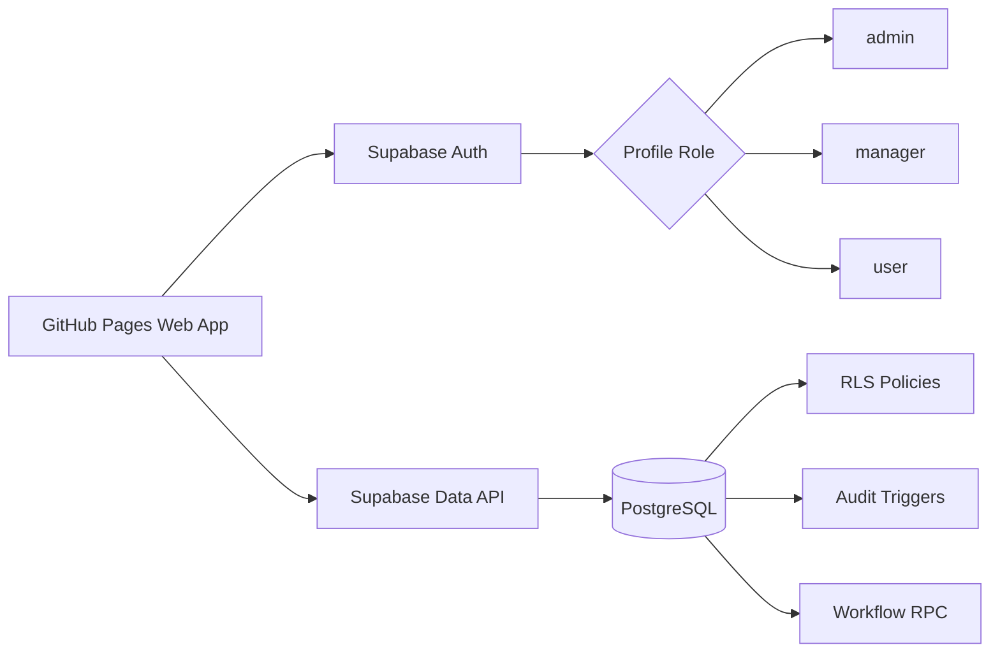
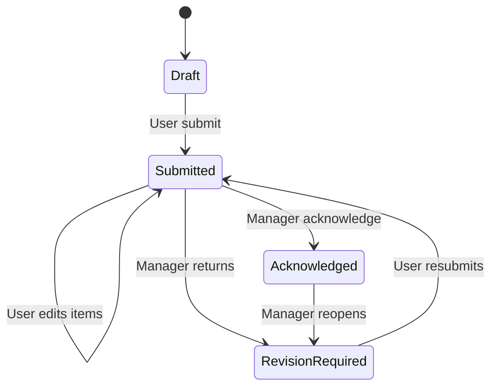
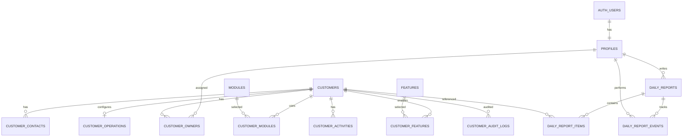

# FI Customer Tracking Web App

> **Current version:** `0.4.0-enterprise-ui`  
> **Base version:** `0.3.0-frontend-foundation`  
> **Current status:** Enterprise UI release package prepared. Database schema, RPC and RLS are unchanged from v0.3.0. This release has not yet been deployed or browser-tested against the real Supabase project.  
> **Runtime stack:** GitHub Pages + Plain HTML/CSS/JavaScript + Supabase Auth/PostgreSQL  
> **Application repository:** `fi-customer-tracking`

## Changelog

### 0.4.0-enterprise-ui

- ปรับ UI ทุกหน้าเป็น Modern Enterprise แบบ Compact-Balanced
- ใช้ Brand Palette จากโลโก้บริษัท: Blue, Cyan และ Mint โดยจำกัดการใช้ Gradient เฉพาะจุดสำคัญ
- ฝังโลโก้แบบ Optimized Data URI ใน `index.html` เพื่อคง Repository เพียง 4 ไฟล์
- ปรับ Login ให้เป็น Enterprise Sign-in Layout พร้อมข้อความระบบและ Security Context
- เพิ่ม Topbar Context, User Avatar, Sidebar แบบยุบได้บน Desktop และ Drawer บน Mobile
- จัด Navigation เป็นกลุ่ม พร้อม SVG Icons, Active State และ `aria-current`
- เพิ่ม Breadcrumb และมาตรฐาน Page Header ให้ทุกหน้าหลัก
- ปรับ Dashboard KPI, Customer List, Daily Report, Manager Reports และ Admin Users ให้มี Visual Hierarchy ชัดเจน
- เพิ่ม Toolbar, Reset Filters, Sorting และ Client-side Pagination สำหรับ Customer List
- เพิ่ม Client-side Pagination สำหรับ Manager Reports
- เพิ่ม Sticky Table Header, Responsive Table Scroll, Empty State และ Table Footer
- ปรับ Form, Dialog และ Modal ให้มี Section, Sticky Header/Footer และ Field Help
- ปรับ Focus, Hover, Disabled, Loading, Toast, Confirmation และ Reduced Motion
- ปรับ Responsive Layout สำหรับ Desktop, Tablet และ Mobile
- คง Business Logic, Supabase Schema, RPC และ RLS เดิม
- อัปเดต Cache Busting และ Version Stamp เป็น `0.4.0-enterprise-ui`

### 0.3.0-frontend-foundation

- สร้าง Frontend แบบ Plain HTML/CSS/JavaScript จำนวน 3 Runtime Files
- เพิ่ม Login/Logout และ Session Handling ด้วย Supabase Auth
- เพิ่ม Role-based navigation สำหรับ `admin`, `manager`, `user`
- เพิ่ม Dashboard, Customer List, Customer Detail และ Customer Audit Log
- เพิ่ม Customer Core, Owners, Contacts, Modules, Features, Operations และ Activities
- เพิ่ม Daily Report แบบ `today` / `tomorrow` พร้อมเพิ่ม แก้ และลบรายการ
- เพิ่ม Manager Review, Acknowledge, Request Revision และ Print/PDF
- เพิ่ม Admin User Role/Active Management ผ่าน RPC
- เพิ่ม Responsive Layout และ A4 Print Layout
- เพิ่ม Migration `003_frontend_support` สำหรับบันทึก Owners และ Primary Contact แบบ Atomic
- เพิ่ม Session Recheck เมื่อ Browser Tab กลับมา Visible
- เพิ่ม Cache Busting ด้วย Version Query String

### 0.2.0-db-foundation

- เพิ่ม SQL Migration เริ่มต้นสำหรับฐานข้อมูลจริง
- เพิ่ม RLS สำหรับ `admin`, `manager`, `user`
- เพิ่ม Customer Audit Log ที่สร้างจาก Database Trigger
- เพิ่ม Daily Report workflow พร้อม `today` และ `tomorrow`
- เพิ่มการล็อก Report หลัง Manager รับทราบ
- เพิ่ม `content_version` ป้องกัน Manager รับทราบข้อมูลเวอร์ชันเก่าในขณะที่ User เพิ่งแก้ไข
- เพิ่ม RPC สำหรับ Submit, Acknowledge, Request Revision, Archive, Restore และจัดการ Role
- เพิ่ม SQL Verification, Role Bootstrap Template และ Rollback
- ปรับ Customer schema ให้รองรับข้อมูลเดิมจาก Spreadsheet

### 0.1.0-design

- ร่าง System Design, Database Relationship, Roles และ Migration Mapping

## 1. System Overview

ระบบภายในสำหรับ:

1. จัดเก็บและติดตามข้อมูลลูกค้า
2. เก็บ Owner ของลูกค้าได้หลายคนแบบ Optional
3. เก็บ Contacts, Modules, Features, Operations และ Activities
4. เก็บประวัติการสร้าง แก้ไข Archive และ Restore ข้อมูลลูกค้า
5. ให้ User ส่ง Daily Report ได้หนึ่งฉบับต่อวัน
6. ให้ Manager รับทราบหรือตีกลับ Daily Report
7. ใช้ Supabase Auth, Grants, RLS, Trigger และ RPC เป็นชั้นควบคุมความปลอดภัย



## 2. Repository Structure

ตามข้อกำหนดปัจจุบัน Repository ฝั่ง Web App มี 4 ไฟล์:

```text
README.md
index.html
script.js
style.css
```

โลโก้บริษัทถูกย่อและฝังเป็น Data URI ภายใน `index.html` จึงไม่ต้องเพิ่มไฟล์รูปภาพใน Repository และยังคงข้อกำหนด 4 ไฟล์

SQL เป็น Deployment Artifacts สำหรับรันผ่าน Supabase SQL Editor และเก็บแยกจาก 4 ไฟล์ใน Repository:

```text
001_initial_schema.sql
001_initial_schema_verify.sql
001_initial_schema_rollback.sql
002_bootstrap_roles_template.sql
003_frontend_support.sql
003_frontend_support_verify.sql
003_frontend_support_rollback.sql
```

> ข้อจำกัด: หากไม่เก็บ SQL ใน Repository จะไม่มี Database Migration History ใน Git จึงต้องเก็บไฟล์ SQL ชุดที่ใช้จริงไว้ในพื้นที่สำรองที่ควบคุม Version ได้

## 3. Confirmed Roles and Permissions

### `user`

- Login เมื่อบัญชี `is_active = true`
- ดูลูกค้าทั้งหมด รวมรายการ Archive
- เพิ่มและแก้ไขลูกค้าทั้งหมด
- Archive ลูกค้า
- แก้ข้อมูลย่อยของลูกค้าที่ไม่ Archive
- ดู Customer Audit Log
- สร้าง Daily Report ของตัวเอง
- ดู Report และ Event ของตัวเอง
- แก้ Report ของตัวเองเมื่อสถานะยังไม่ถูกล็อก
- ดู Report ของ User คนอื่นไม่ได้

### `manager`

- มี Active Manager ได้ไม่เกิน 1 คน
- ดู เพิ่ม แก้ไข และ Archive ลูกค้าทั้งหมด
- ดู Customer Audit Log
- ดู Daily Report ของ User ทุกคน
- รับทราบ Report
- ตีกลับ Report พร้อมเหตุผล
- แก้เนื้อหา Report แทน User ไม่ได้
- Restore ลูกค้าไม่ได้

### `admin`

- ดูและแก้ไขลูกค้าทั้งหมด
- Archive และ Restore ลูกค้า
- ดู Report ทั้งหมด
- รับทราบหรือตีกลับ Report
- เปลี่ยน Role และ Active Status ของบัญชีอื่นผ่าน RPC
- จัดการ Master Modules และ Features
- เปลี่ยน Role หรือปิดบัญชีตัวเองผ่าน RPC ไม่ได้ เพื่อป้องกันการล็อกระบบโดยไม่ตั้งใจ

### Permission Matrix

| Resource / Action | Admin | Manager | User |
|---|---:|---:|---:|
| อ่านลูกค้าทั้งหมด | Yes | Yes | Yes |
| เพิ่ม/แก้ลูกค้าที่ยังไม่ Archive | Yes | Yes | Yes |
| Archive ลูกค้า | Yes | Yes | Yes |
| Restore ลูกค้า | Yes | No | No |
| Hard Delete ลูกค้าผ่าน Client | No | No | No |
| อ่าน Customer Audit Log | Yes | Yes | Yes |
| แก้ Audit Log | No | No | No |
| อ่าน Daily Report ทั้งหมด | Yes | Yes | No |
| อ่าน Daily Report ของตัวเอง | N/A | N/A | Yes |
| สร้าง Daily Report | No | No | Own only |
| แก้ Report Items | No | No | Own and unlocked |
| รับทราบ/ตีกลับ Report | Yes | Yes | No |
| จัดการ Role | Yes | No | No |
| จัดการ Module/Feature Master | Yes | No | No |

## 4. Customer Rules

- ลูกค้าหนึ่งรายมี Owner ได้ 0 คน, 1 คน หรือหลายคน
- ลูกค้ามี Primary Owner ได้ไม่เกิน 1 คน
- Owner ใช้ระบุผู้รับผิดชอบและกรองข้อมูล ไม่ได้จำกัดการมองเห็น
- ทุก Active Role แก้ไขลูกค้าทั้งหมดได้
- User/Manager แก้ข้อมูลลูกค้าที่ Archive แล้วไม่ได้
- Admin แก้หรือ Restore ลูกค้าที่ Archive ได้
- ไม่มี Client Policy สำหรับ Hard Delete
- `tax_id` ต้องเป็นตัวเลข 13 หลักและไม่ซ้ำ
- วันที่เก็บเป็น ค.ศ. ด้วย PostgreSQL `date`
- Timestamp เก็บเป็น `timestamptz`; Frontend ต้องแสดงผลด้วย Timezone `Asia/Bangkok`
- `created_by`, `updated_by`, `archived_by` อ้างอิง `profiles.id`
- `legacy_created_by_email` และ `legacy_updated_by_email` ใช้เก็บ Snapshot จาก Spreadsheet เดิม
- `legacy_*` แก้ไม่ได้จาก Authenticated Client หลังสร้าง

## 5. Daily Report Rules

- หนึ่ง User มี Report ได้หนึ่งฉบับต่อหนึ่ง `work_date`
- Report หนึ่งฉบับมีรายการหลายข้อ
- แต่ละข้ออยู่ใน Section `today` หรือ `tomorrow`
- `customer_id` ของแต่ละข้อเป็น Optional
- ข้อความแต่ละข้อยาว 1–5,000 ตัวอักษร
- User แก้ Item ได้เมื่อ Report เป็น:
  - `draft`
  - `submitted`
  - `revision_required`
- User แก้ Item ไม่ได้เมื่อ Report เป็น `acknowledged`
- Manager ต้องกดรับทราบอย่างชัดเจน ระบบไม่ล็อกเพียงเพราะเปิดหน้า
- Manager ตีกลับจาก `submitted` หรือ `acknowledged` ได้และต้องระบุเหตุผล
- Report ที่ถูกตีกลับใช้ Record เดิม ไม่สร้างฉบับใหม่



### Concurrency Protection

`daily_reports.content_version` เพิ่มขึ้นทุกครั้งที่ Item ถูกเพิ่ม แก้ หรือลบ

Manager ต้องส่ง `expected_content_version` ไปยัง RPC:

- `acknowledge_daily_report`
- `request_daily_report_revision`

หาก User แก้ไข Report หลังจาก Manager เปิดอ่าน RPC จะปฏิเสธและให้ Manager Reload ก่อน จึงไม่รับทราบหรือตีกลับจากเนื้อหาเวอร์ชันเก่า

## 6. Database Relationship



## 7. Current Database Schema

### 7.1 `profiles`

Purpose: Application profile linked one-to-one with `auth.users`.

| Column | Type | Nullable | Default / Key |
|---|---|---:|---|
| `id` | `uuid` | No | PK, FK → `auth.users.id`, delete restricted |
| `display_name` | `text` | No | Non-blank |
| `email` | `text` | No | Unique by lowercase |
| `role` | `text` | No | `user` |
| `is_active` | `boolean` | No | `true` |
| `created_at` | `timestamptz` | No | Current timestamp |
| `updated_at` | `timestamptz` | No | Current timestamp |

Constraints and indexes:

- `display_name` สูงสุด 200 ตัวอักษร
- `email` สูงสุด 320 ตัวอักษร
- Role: `admin`, `manager`, `user`
- Unique index on `lower(email)`
- Partial unique index permits at most one row where `role = 'manager' AND is_active = true`
- Auth User deletion is restricted; deactivate the Profile instead

### 7.2 `customers`

Purpose: Current customer master data.

| Column | Type | Nullable | Default / Key |
|---|---|---:|---|
| `id` | `uuid` | No | PK |
| `legacy_customer_id` | `text` | Yes | Partial unique |
| `legal_name` | `text` | No | Non-blank |
| `short_name` | `text` | Yes | |
| `tax_id` | `text` | No | Unique, 13 digits |
| `fleet_size` | `integer` | No | `0`, nonnegative |
| `account_status` | `text` | No | `active` |
| `onboarding_stage` | `text` | Yes | Controlled values |
| `import_status` | `text` | No | `waiting` |
| `engagement_level` | `text` | Yes | Controlled values |
| `start_date` | `date` | Yes | C.E. |
| `billing_date` | `date` | Yes | C.E. |
| `is_archived` | `boolean` | No | `false` |
| `archived_at` | `timestamptz` | Yes | |
| `archived_by` | `uuid` | Yes | FK → `profiles.id` |
| `created_at` | `timestamptz` | No | |
| `created_by` | `uuid` | No | FK → `profiles.id` |
| `updated_at` | `timestamptz` | No | |
| `updated_by` | `uuid` | No | FK → `profiles.id` |
| `legacy_created_by_email` | `text` | Yes | Spreadsheet snapshot |
| `legacy_updated_by_email` | `text` | Yes | Spreadsheet snapshot |

Length rules:

- `legacy_customer_id` สูงสุด 100 ตัวอักษร
- `legal_name` สูงสุด 500 ตัวอักษร
- `short_name` สูงสุด 300 ตัวอักษร

Controlled values:

- `account_status`: `active`, `inactive`
- `onboarding_stage`: `to_do`, `pending_data`, `onboarding`, `training_completed`, `go_live`
- `import_status`: `waiting`, `in_process`, `done`
- `engagement_level`: `interest`, `neutral`, `null`

Indexes:

- Unique `tax_id`
- Partial unique `legacy_customer_id`
- `legal_name`
- `short_name`
- `account_status`
- `onboarding_stage`
- `import_status`
- `(is_archived, updated_at DESC)`

### 7.3 `customer_owners`

Purpose: Many-to-many customer ownership.

| Column | Type | Nullable | Key |
|---|---|---:|---|
| `customer_id` | `uuid` | No | PK, FK → `customers.id` |
| `profile_id` | `uuid` | No | PK, FK → `profiles.id` |
| `is_primary` | `boolean` | No | `false` |
| `created_at` | `timestamptz` | No | |
| `created_by` | `uuid` | No | FK |
| `updated_at` | `timestamptz` | No | |
| `updated_by` | `uuid` | No | FK |

PK: `(customer_id, profile_id)`

Index:

- Unique primary owner per customer
- `profile_id`

### 7.4 `customer_contacts`

| Column | Type | Nullable | Key / Rule |
|---|---|---:|---|
| `id` | `uuid` | No | PK |
| `customer_id` | `uuid` | No | FK → `customers.id` |
| `contact_name` | `text` | No | Non-blank |
| `position` | `text` | Yes | |
| `phone` | `text` | Yes | |
| `email` | `text` | Yes | |
| `line_id` | `text` | Yes | |
| `is_primary` | `boolean` | No | `false` |
| `is_active` | `boolean` | No | `true` |
| `created_at/by` | timestamp/uuid | No | Audit metadata |
| `updated_at/by` | timestamp/uuid | No | Audit metadata |

Active Primary Contact มีได้ไม่เกิน 1 คนต่อลูกค้า

Length rules: ชื่อ 200, ตำแหน่ง 200, โทรศัพท์ 100, Email 320 และ LINE ID 100 ตัวอักษร

### 7.5 `modules`

Master data:

| Column | Type | Nullable | Key / Rule |
|---|---|---:|---|
| `id` | `uuid` | No | PK |
| `code` | `text` | No | Unique, lowercase code |
| `name` | `text` | No | Non-blank |
| `is_active` | `boolean` | No | `true` |
| `created_at` | `timestamptz` | No | |
| `updated_at` | `timestamptz` | No | |

Code ยาวไม่เกิน 100 ตัวอักษร และ Name ยาวไม่เกิน 200 ตัวอักษร

Initial rows:

- `erp`
- `maintenance`
- `ai`

### 7.6 `customer_modules`

PK: `(customer_id, module_id)`

Columns:

- `customer_id` FK → `customers`
- `module_id` FK → `modules`
- `created_at/by`
- `updated_at/by`

### 7.7 `features`

Same structure as `modules`.

Initial rows:

- `project` → โครงการ
- `live_entry` → คีย์สด

### 7.8 `customer_features`

PK: `(customer_id, feature_id)`

Columns:

- `customer_id` FK → `customers`
- `feature_id` FK → `features`
- `created_at/by`
- `updated_at/by`

### 7.9 `customer_operations`

One-to-one with Customer.

| Column | Type | Nullable | Key |
|---|---|---:|---|
| `customer_id` | `uuid` | No | PK, FK |
| `driver_payment_method` | `text` | Yes | |
| `trip_expense_management` | `text` | Yes | |
| `created_at/by` | timestamp/uuid | No | |
| `updated_at/by` | timestamp/uuid | No | |

สองช่องยังเป็น Free Text เพราะข้อมูลจริงมีหลายรูปแบบและ Business Rule ยังไม่เสถียร โดยแต่ละช่องยาวได้ไม่เกิน 5,000 ตัวอักษร

### 7.10 `customer_activities`

Human-readable Customer Timeline.

| Column | Type | Nullable | Rule |
|---|---|---:|---|
| `id` | `uuid` | No | PK |
| `customer_id` | `uuid` | No | FK |
| `activity_type` | `text` | No | `note`, `call`, `meeting`, `follow_up`, `system` |
| `detail` | `text` | No | Non-blank |
| `activity_date` | `date` | No | Current date in `Asia/Bangkok` |
| `created_at/by` | timestamp/uuid | No | |
| `updated_at/by` | timestamp/uuid | No | |

`detail` ยาวได้ไม่เกิน 10,000 ตัวอักษร

Index: `(customer_id, activity_date DESC, created_at DESC)`

### 7.11 `customer_audit_logs`

Immutable audit records generated by Trigger.

| Column | Type | Nullable | Meaning |
|---|---|---:|---|
| `id` | `bigint identity` | No | PK |
| `customer_id` | `uuid` | No | FK |
| `source_table` | `text` | No | Source table |
| `record_id` | `text` | No | Source record key |
| `action` | `text` | No | Insert/update/archive/restore/delete child |
| `changed_fields` | `text[]` | Yes | Business fields changed |
| `old_data` | `jsonb` | Yes | Previous row |
| `new_data` | `jsonb` | Yes | New row |
| `actor_id` | `uuid` | Yes | `auth.uid()` or null for SQL migration |
| `created_at` | `timestamptz` | No | Event time |

Audited tables:

- `customers`
- `customer_owners`
- `customer_contacts`
- `customer_modules`
- `customer_features`
- `customer_operations`
- `customer_activities`

Client อ่านได้ แต่ Insert/Update/Delete ไม่ได้

### 7.12 `daily_reports`

| Column | Type | Nullable | Key / Rule |
|---|---|---:|---|
| `id` | `uuid` | No | PK |
| `user_id` | `uuid` | No | FK → `profiles.id` |
| `work_date` | `date` | No | Unique with user |
| `status` | `text` | No | `draft` |
| `content_version` | `bigint` | No | `0` |
| `submitted_at` | `timestamptz` | Yes | |
| `acknowledged_at` | `timestamptz` | Yes | |
| `acknowledged_by` | `uuid` | Yes | FK |
| `last_revision_reason` | `text` | Yes | |
| `revision_requested_at` | `timestamptz` | Yes | |
| `revision_requested_by` | `uuid` | Yes | FK |
| `created_at` | `timestamptz` | No | |
| `updated_at` | `timestamptz` | No | |

Constraints:

- Unique `(user_id, work_date)`
- Status: `draft`, `submitted`, `acknowledged`, `revision_required`
- Acknowledgement columns must be present only in `acknowledged`
- Revision reason/timestamp/actor required in `revision_required`
- Revision reason ยาวได้ไม่เกิน 2,000 ตัวอักษร

Indexes:

- `(work_date DESC, status)`
- `(user_id, work_date DESC)`

### 7.13 `daily_report_items`

| Column | Type | Nullable | Rule |
|---|---|---:|---|
| `id` | `uuid` | No | PK |
| `report_id` | `uuid` | No | FK |
| `section` | `text` | No | `today`, `tomorrow` |
| `customer_id` | `uuid` | Yes | Optional FK |
| `detail` | `text` | No | 1–5,000 characters |
| `sort_order` | `integer` | No | Nonnegative |
| `created_at` | `timestamptz` | No | |
| `updated_at` | `timestamptz` | No | |

Before Trigger locks the parent Report row and rechecks owner/status. After Trigger increments `content_version`.

### 7.14 `daily_report_events`

Immutable workflow history.

| Column | Type | Nullable | Meaning |
|---|---|---:|---|
| `id` | `bigint identity` | No | PK |
| `report_id` | `uuid` | No | FK |
| `event_type` | `text` | No | Workflow event |
| `from_status` | `text` | Yes | Previous status |
| `to_status` | `text` | No | New status |
| `reason` | `text` | Yes | Revision reason |
| `content_version` | `bigint` | No | Content version at event |
| `actor_id` | `uuid` | No | FK |
| `created_at` | `timestamptz` | No | |

Events:

- `created`
- `submitted`
- `resubmitted`
- `acknowledged`
- `revision_requested`

### 7.15 `app_private.schema_migrations`

Private migration registry. ไม่เปิดผ่าน Data API

Current applied versions after successful installation:

```text
001_initial_schema
003_frontend_support
```

## 8. RLS Design

RLS เปิดบน Public Application Tables ทั้ง 14 ตาราง

Private helper functions:

- `app_private.current_user_role()`
- `app_private.is_active_user()`
- `app_private.is_admin()`
- `app_private.is_manager_or_admin()`
- `app_private.can_edit_customer(uuid)`
- `app_private.can_read_daily_report(uuid)`
- `app_private.can_edit_daily_report(uuid)`

หลักการ:

- `anon` ไม่มี Table Privilege
- `authenticated` ได้เฉพาะ Grants ที่จำเป็น
- RLS ตรวจ Active Profile, Role, Ownership และ Lock Status
- Security Definer Functions กำหนด `search_path`
- Trigger/RPC ที่มีสิทธิ์สูงตรวจ Actor และ Business Rule ภายใน Function
- ไม่มี RLS Policy หรือ Grant สำหรับ Hard Delete `customers`
- ไม่มี Client Write Permission สำหรับ Audit/Event Log

## 9. Public RPC Functions

| Function | Actor | Purpose |
|---|---|---|
| `submit_daily_report(uuid)` | Report owner | Submit/Resubmit |
| `acknowledge_daily_report(uuid, bigint)` | Manager/Admin | Acknowledge current content version |
| `request_daily_report_revision(uuid, text, bigint)` | Manager/Admin | Return with reason |
| `archive_customer(uuid)` | Any active role | Archive customer |
| `restore_customer(uuid)` | Admin | Restore customer |
| `admin_update_profile(uuid, text, boolean)` | Admin | Change another user's role/active status |
| `save_customer_owners(uuid, uuid[], uuid)` | Any active role | Replace owners and primary owner atomically |
| `save_customer_contact(uuid, uuid, text, text, text, text, text, boolean, boolean)` | Any active role | Insert/update contact and primary contact atomically |

Frontend ต้องเรียก Workflow และ Aggregate Save ผ่าน RPC เหล่านี้ ไม่อัปเดต Workflow Columns โดยตรง

## 10. Auth and Profile Bootstrap

### Auth Configuration

Recommended Supabase settings:

```text
Email + Password: Enabled
Public signup: Disabled
Anonymous sign-in: Disabled
Email confirmation: Enabled
```

เมื่อสร้าง User ใน Supabase Auth Trigger จะสร้าง `public.profiles` โดยอัตโนมัติด้วย Role `user`

Migration มี Backfill สำหรับ Auth Users ที่มีอยู่ก่อนรัน SQL

### First Admin and Manager

1. สร้าง Admin User และ Manager User ที่ Supabase Dashboard → Authentication → Users
2. รัน `002_bootstrap_roles_template.sql` หลังแทน Email Placeholder
3. ตรวจว่า Query ท้ายไฟล์คืน:
   - Admin ที่ Active
   - Manager ที่ Active เพียงหนึ่งคน

ห้ามใส่ Password ใน SQL, README หรือ Repository

## 11. Environment Configuration

Runtime files จะใช้ Public Configuration เท่านั้น:

```javascript
const SUPABASE_URL = "https://YOUR_PROJECT_REF.supabase.co";
const SUPABASE_PUBLISHABLE_KEY = "YOUR_PUBLISHABLE_KEY";
```

อนุญาตใน Browser:

- Project URL
- Publishable Key หรือ Legacy Anon Key

ห้ามใส่:

- Database Password
- Secret Key
- `service_role` Key
- Personal Access Token
- Private API Key

ความปลอดภัยของข้อมูลไม่ได้พึ่งการซ่อน Publishable Key แต่พึ่ง Grants, RLS, Trigger และ RPC

## 12. Migration Files

### `001_initial_schema.sql`

สร้าง:

- 14 Public Tables
- Private Migration Registry
- Constraints and Indexes
- Auth/Profile Triggers
- Customer Metadata and Audit Triggers
- Daily Report Locking/Version Triggers
- RLS Policies
- Grants
- RPC Functions
- Initial Modules and Features

### `001_initial_schema_verify.sql`

Read-only checks:

- Migration version
- Expected tables
- RLS status
- Policy inventory
- Master data
- Single Manager condition
- Anonymous privilege check
- RPC inventory
- Trigger inventory

### `001_initial_schema_rollback.sql`

Destructive rollback:

- ลบ App Triggers บน `auth.users`
- ลบ RPC
- ลบ Application Tables และข้อมูลทั้งหมด
- ลบ `app_private`

ห้ามรันโดยไม่มี Backup

### `002_bootstrap_roles_template.sql`

ใช้กำหนด First Admin และ Single Manager หลังสร้าง Auth Users

### `003_frontend_support.sql`

เพิ่ม RPC สำหรับ Frontend:

- Replace Customer Owners และ Primary Owner ใน Transaction เดียว
- Insert/Update Contact และสลับ Primary Contact ใน Transaction เดียว
- ตรวจ Active Profile และสิทธิ์แก้ Customer ภายใน Function

### `003_frontend_support_verify.sql`

ตรวจว่า RPC ทั้งสอง Function มีอยู่และ `authenticated` มี Execute Privilege

### `003_frontend_support_rollback.sql`

ลบ Frontend Support RPC โดยไม่ลบ Customer Data

## 13. Installation Order

### Before Running SQL

- ใช้ Supabase Development Project
- ตรวจว่า `Automatically expose new tables` ปิด
- ตรวจว่า `Enable automatic RLS` เปิด
- ยังไม่นำข้อมูลลูกค้าจริงเข้า
- Export/Backup หาก Project มีข้อมูลเดิม
- ตรวจว่าไม่มีตารางชื่อซ้ำกับ Schema นี้

### Apply Migration

1. เปิด Supabase Dashboard
2. ไปที่ SQL Editor
3. สร้าง New Query
4. วางเนื้อหา `001_initial_schema.sql`
5. Run ทั้งไฟล์ครั้งเดียว
6. รัน `003_frontend_support.sql`
7. หากมี Error Transaction จะ Rollback
8. อย่ารัน Migration เดิมซ้ำหลังสำเร็จ เพราะ Migration Guard จะปฏิเสธ

### Verify

1. รัน `001_initial_schema_verify.sql`
2. รัน `003_frontend_support_verify.sql`
3. ตรวจ Public Tables ครบ 14 ตาราง
4. ตรวจ RLS เป็น `true` ทุกตาราง
5. ตรวจ `anon` ไม่มี Table Privilege
6. ตรวจ Public RPC ครบตาม Section 9
7. เปิด Database → Advisors
8. Rerun Security Advisor และ Performance Advisor

### Bootstrap Roles

1. สร้าง Auth Users
2. แทน Admin และ Manager Email ใน Template
3. รัน `002_bootstrap_roles_template.sql`
4. ห้าม Commit Template ที่ใส่ Email จริงหาก Email เป็นข้อมูลภายใน

## 14. Spreadsheet Migration Mapping

Source Spreadsheet ปัจจุบันมี 74 ลูกค้าและ 22 คอลัมน์

| Spreadsheet | Target |
|---|---|
| `Customer ID` | `customers.legacy_customer_id` |
| `Customer` | `customers.legal_name` |
| `Short Name` | `customers.short_name` |
| `Tax ID` | `customers.tax_id` |
| `Contact` | Split → `customer_contacts` |
| `Owner` | Map Profile → `customer_owners` |
| `Cars` | `customers.fleet_size` |
| `Modules` | Split `+` → `customer_modules` |
| `function` | Split `+` → `customer_features` |
| `Start` | Convert C.E. → `customers.start_date` |
| `Billing Date` | Convert C.E. → `customers.billing_date` |
| `Engagement Level` | `customers.engagement_level` |
| `Status` | `customers.account_status` |
| `Main Status` | `customers.onboarding_stage` |
| `Import data` | `customers.import_status` |
| `Remark` | Initial `customer_activities` |
| `Driver Payment Method` | `customer_operations.driver_payment_method` |
| `Trip Expense Management` | `customer_operations.trip_expense_management` |
| `Created By` | `legacy_created_by_email` |
| `Created At` | Converted source timestamp |
| `Updated By` | `legacy_updated_by_email` |
| `Updated At` | Source empty; do not invent historical value |

Migration policy:

- ทำ Dry Run ผ่าน Staging ก่อน
- ปีช่วง 2400–2600 เสนอแปลงด้วย `year - 543` และสร้าง Review Report
- ไม่แก้ค่าต้นฉบับเงียบ ๆ
- Contact หลายชื่อแยกเป็นหลาย Record
- Module/Function แยกด้วย `+`
- Remark ย้ายเป็น Activity
- ผู้รัน Import เป็น System `created_by/updated_by`
- Email จาก Sheet เก็บเป็น Legacy Snapshot
- Backup ไฟล์ต้นฉบับก่อน Import

## 15. Testing Checklist for Database Foundation

ต้องทดสอบจริงหลังรันบน Development Project:

### Auth/Profile

- สร้าง Auth User แล้ว Profile ถูกสร้าง
- Email เปลี่ยนแล้ว Profile sync
- Inactive User อ่านหรือเขียน Application Data ไม่ได้
- Active Manager มีได้ไม่เกิน 1 คน

### Customers

- ทุก Active Role อ่านลูกค้าทั้งหมดได้
- ทุก Active Role เพิ่มและแก้ลูกค้าที่ยังไม่ Archive ได้
- User/Manager Archive ได้
- User/Manager แก้ลูกค้าที่ Archive ไม่ได้
- Admin Restore ได้
- Tax ID ซ้ำหรือไม่ครบ 13 หลักถูกปฏิเสธ
- Create/Update/Archive/Restore มี Audit Log
- Child Insert/Update/Delete มี Audit Log

### Daily Reports

- User สร้างได้หนึ่งฉบับต่อวัน
- User คนอื่นอ่าน Report ไม่ได้
- Manager/Admin อ่าน Report ทั้งหมดได้
- Draft ที่ไม่มี Item Submit ไม่ได้
- User แก้ Submitted Report ได้
- Acknowledged Report แก้ไม่ได้
- Manager ตีกลับพร้อมเหตุผลได้
- User Resubmit ได้
- Manager ใช้ Content Version เก่าแล้ว RPC ถูกปฏิเสธ
- Manager แก้ Report Item ไม่ได้

### Security

- `anon` อ่านตารางไม่ได้
- Client เขียน Audit/Event Log ไม่ได้
- Client Hard Delete Customer ไม่ได้
- Security Advisor ไม่มี Error สำคัญ
- ไม่มี Secret ใน SQL, README หรือ Frontend

## 15.1 Frontend Test Checklist

ต้องทดสอบบน Local HTTP และ GitHub Pages URL จริง:

- Login, Logout, Session Restore และ Session Refresh
- Inactive User ถูกปฏิเสธ
- Navigation ตรงกับ Role
- Customer Create/Edit/Archive/Restore
- Tax ID Validation และ Duplicate Error
- Owner Save และ Primary Owner
- Contact Save และ Primary Contact
- Module/Feature Toggle
- Operations และ Timeline
- Audit Log แสดง Actor/Timestamp
- Daily Report หนึ่งฉบับต่อวัน
- Add/Edit/Delete Today และ Tomorrow
- Submit, Acknowledge, Revision และ Resubmit
- Content Version Conflict
- User อ่าน Report ของผู้อื่นไม่ได้
- Manager แก้ Report Item ไม่ได้
- Admin Role/Active Update
- Mobile Layout
- Print/PDF A4
- Browser Console และ Network ไม่มี Error ที่ไม่คาดหมาย
- GitHub Pages Hard Refresh และ Cache Busting

## 16. Frontend and Deployment

### Implemented Screens

- Login
- Dashboard ตาม Role
- Customer List พร้อม Search/Filter
- Customer Detail
- Customer Core Create/Edit
- Owners และ Primary Owner
- Contacts และ Primary Contact
- Modules และ Features
- Driver Payment Method และ Trip Expense Management
- Timeline/Activities
- Customer Audit Log
- User Daily Report
- Manager Report Review/Acknowledge/Revision
- Print/PDF A4
- Admin Role/Active Management

### Enterprise UI Design System

แนวทางปัจจุบัน:

- Layout: 8px spacing grid และ Content-first
- Density: Enterprise Compact-Balanced
- Primary color: Blue `#2f68e6`
- Supporting brand colors: Cyan `#2dcfc6`, Mint `#35dfa0`
- Main background: Neutral `#f5f7fb`
- Surface: White with subtle border and minimal shadow
- Desktop sidebar: 268px และยุบเหลือ 80px โดยบันทึกค่าที่ `localStorage`
- Content width: สูงสุด 1,680px พร้อม Margin 24–32px ตามขนาดหน้าจอ
- Form: Label อยู่เหนือ Input และ Modal แบ่ง Section
- Table: Sticky Header, Row Hover, Pagination และ Horizontal Scroll บนหน้าจอเล็ก
- Accessibility: Keyboard focus, semantic labels, `aria-current`, skip link และ reduced-motion support
- Responsive breakpoint หลัก: 1,180px, 820px และ 480px

UI release นี้ไม่เพิ่ม Table, Column, RPC, RLS Policy หรือ Business Status ใหม่

### Frontend Configuration

แก้เฉพาะสองค่าใน `script.js`:

```javascript
const SUPABASE_URL = "https://YOUR_PROJECT_REF.supabase.co";
const SUPABASE_PUBLISHABLE_KEY = "YOUR_PUBLISHABLE_KEY";
```

ห้ามใช้ Database Password, Secret Key หรือ `service_role`

### Local Test

เนื่องจากเป็น Static Files สามารถใช้ Local HTTP Server เช่น:

```bash
python3 -m http.server 8080
```

เปิด:

```text
http://localhost:8080
```

ไม่แนะนำเปิด `index.html` ผ่าน `file://` เพราะ Browser/CDN/Auth behavior อาจต่างจาก GitHub Pages

### GitHub Pages Deployment

1. วาง `README.md`, `index.html`, `script.js`, `style.css` ที่ Root ของ Repository
2. แก้ Public Supabase Configuration ใน `script.js`
3. Commit และ Push ไป Branch `main`
4. ไปที่ Repository → Settings → Pages
5. เลือก Deploy from a branch
6. Branch: `main`
7. Folder: `/ (root)`
8. บันทึกและรอ GitHub Pages Deploy
9. เปิด URL จริงและทดสอบ Login ทุก Role

### Cache Busting

`index.html` โหลดไฟล์ด้วย:

```text
style.css?v=0.4.0-enterprise-ui
script.js?v=0.4.0-enterprise-ui
```

เมื่อ Release ใหม่ต้องอัปเดต Version ใน:

- `APP_VERSION` ใน `script.js`
- Query String ของ `style.css` และ `script.js` ใน `index.html`
- Current Version และ Changelog ใน `README.md`

## 17. Rollback

### Frontend Rollback

หาก v0.4.0 มีปัญหาหลัง Deploy:

1. Restore `README.md`, `index.html`, `script.js`, `style.css` จาก Tag/Commit ของ v0.3.0
2. Push กลับไปที่ `main`
3. รอ GitHub Pages Deploy
4. Hard Refresh และตรวจ Version ที่ Sidebar/Login
5. ไม่ต้อง Rollback Database เพราะ Release นี้ไม่แก้ Schema, RPC หรือ RLS

ก่อน Rollback:

1. Export/Backup Application Tables
2. ตรวจว่าไม่มี Migration หลัง `001_initial_schema`
3. ตรวจว่าไม่มีข้อมูลจริงที่ต้องเก็บ
4. เก็บรายชื่อ Auth Users ไว้

หากย้อนเฉพาะ Frontend Support RPC ให้รัน:

```text
003_frontend_support_rollback.sql
```

หากย้อนฐานข้อมูลทั้งหมดให้รัน:

```text
001_initial_schema_rollback.sql
```

ผลกระทบ:

- Application Tables และข้อมูลถูกลบ
- Profile ถูกลบ แต่ `auth.users` ยังคงอยู่
- App Triggers บน `auth.users` ถูกลบ
- Private Helper/RPC ถูกลบ
- GitHub Pages ไม่ทำงานจนกว่าจะ Restore Database Version ที่เข้ากัน

## 17.1 UI Release Validation

ตรวจแล้วใน Release Package:

- `node --check script.js`
- ตรวจ HTML ID ไม่ซ้ำ
- ตรวจ Cache Busting ตรงกับ `APP_VERSION`
- ตรวจ CSS bracket balance และ media query structure
- ตรวจ Package มีเฉพาะ 4 ไฟล์ตามข้อกำหนด
- ตรวจไม่พบ Database Password, Secret Key หรือ `service_role`
- ตรวจ ZIP integrity

ยังไม่ได้ทดสอบจริง:

- Login/Logout กับ Supabase Project จริง
- RLS/RPC Runtime ของทุก Role
- Browser visual regression บน GitHub Pages URL จริง
- Mobile devices จริง
- Print/PDF ในทุก Browser
- Screen reader end-to-end

## 18. Known Limitations

- งานรอบนี้ไม่เปลี่ยน SQL และไม่ได้รันทดสอบ SQL/RLS/RPC ซ้ำกับ Supabase Project จริง
- ยังไม่ได้ทดสอบ PostgreSQL Runtime, RLS, Trigger หรือ RPC กับ Supabase จริง
- Frontend v0.4.0 ผ่าน Syntax Check และ Static Validation แต่ยังไม่ได้ทดสอบ Browser Runtime กับ Project URL/Key จริง
- ยังไม่ได้รัน Supabase Security/Performance Advisor
- ยังไม่ได้ทำ Spreadsheet Migration Dry Run
- ยังไม่ได้ทดสอบ Role/RLS ด้วยบัญชีจริง
- User และ Manager แก้ลูกค้าทั้งหมดได้ตาม Requirement ซึ่งมีความเสี่ยงจาก Human Error; Audit และ Archive ช่วยตรวจย้อนหลังแต่ไม่ป้องกันการแก้ผิดทั้งหมด
- Customer Core Edit ยังไม่มี Optimistic Lock; การแก้ข้อมูลหลักพร้อมกันอาจเกิด Last-write-wins
- Module/Feature Toggle เป็นการบันทึกทีละรายการ ไม่ใช่ Aggregate Transaction
- Daily Report Item บันทึกทีละข้อเพื่อหลีกเลี่ยงการลบ/แทนที่ทั้งชุด
- Manager Page โหลด Report ย้อนหลัง 60 วันต่อครั้ง
- การสร้าง/เชิญ Auth User ต้องทำผ่าน Supabase Dashboard เพราะ Browser ห้ามใช้ Admin Secret API
- Module/Feature Master Changes ยังไม่มี Dedicated Admin Audit Log
- Profile Role Changes ยังไม่มี Dedicated Admin Audit Log
- SQL ไม่อยู่ใน 4 Runtime Files ตามโครงสร้าง Repo ที่เลือก จึงต้องจัดเก็บ Migration Artifacts แยกอย่างมี Version
- Driver Payment Method และ Trip Expense Management ยังเป็น Free Text
- Email Notification ยังไม่อยู่ใน Scope
- Frontend โหลด `supabase-js` ผ่าน CDN จึงต้องมี Internet Access และควรทดสอบ CDN/CSP บน URL จริง
