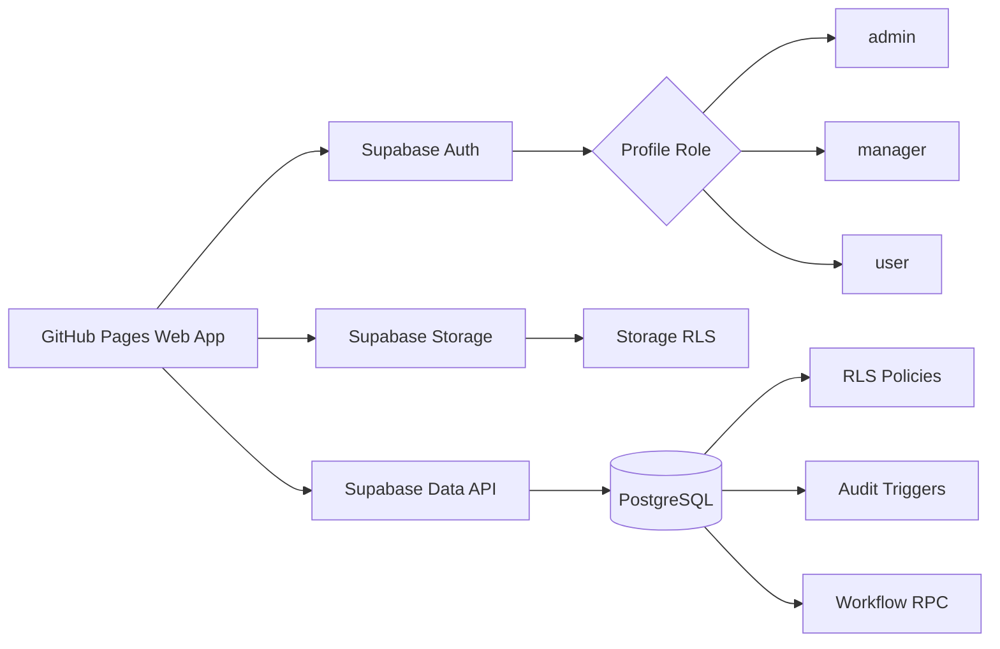
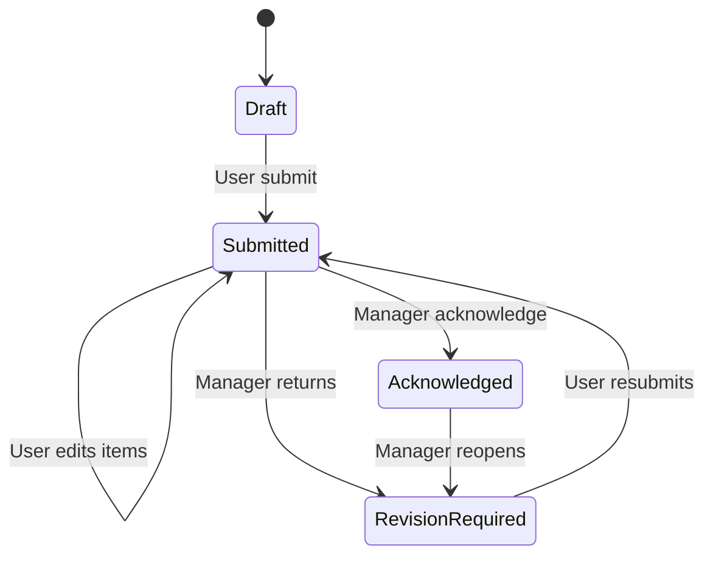
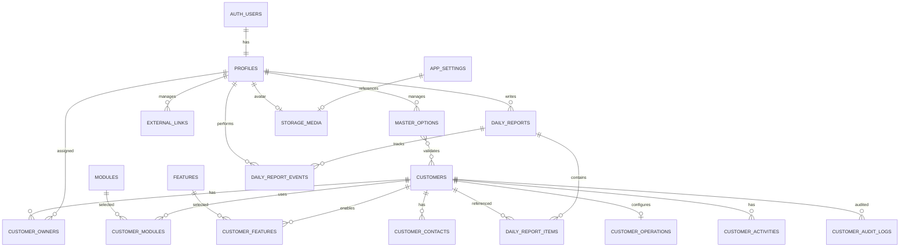

# FI Customer Tracking Web App

> **Current version:** `0.7.1-settings-hotfix`  
> **Base version:** `0.7.0-system-settings`  
> **Current status:** Frontend hotfix prepared for system settings. Saving external links, master data and branding now updates only the affected content instead of rebuilding the whole page. Navigation refreshes immediately, public branding failures no longer block Login, favicon MIME is derived from the uploaded file type, and Module/Feature code validation matches the database constraint. Database schema, RLS, Storage policies and Migration `005_system_settings_media_master_data` are unchanged. Static checks passed; runtime testing against the real Supabase project is still required.  

> **Runtime stack:** GitHub Pages + Plain HTML/CSS/JavaScript + Supabase Auth/PostgreSQL  
> **Application repository:** `fi-customer-tracking`

## Changelog

### 0.7.1-settings-hotfix

- แก้อาการหน้า `ลิงก์เว็บไซต์ภายนอก` และ `ข้อมูลตัวเลือกกลาง` กะพริบเหมือน Refresh หลังบันทึก
- เปลี่ยนการบันทึกให้รับ Row ที่บันทึกสำเร็จกลับมา แล้วอัปเดต State, จำนวนรายการ และ List เฉพาะส่วน
- หลังเพิ่ม แก้ไข ปิดใช้งาน หรือลบลิงก์ เมนูเว็บไซต์ภายนอกใน Sidebar อัปเดตทันที
- แยกการโหลดข้อมูลลิงก์และ Master ออกจาก `loadCommonData()` เพื่อลด Query ที่ไม่เกี่ยวข้องและไม่สร้าง Signed URL รูปโปรไฟล์ซ้ำ
- ปรับ Module/Feature code ให้รับเฉพาะตัวอักษรอังกฤษ ตัวเลข และ `_` ก่อนแปลงเป็นตัวพิมพ์เล็กให้ตรงกับ Database CHECK
- แก้ MIME ของ Favicon ให้รองรับ PNG, WebP, JPEG, ICO และ SVG ตามนามสกุลจริง
- การโหลด Branding ก่อน Login เป็น Optional Failure: หาก Query ล้มเหลว ระบบใช้ภาพและไอคอนเริ่มต้นต่อโดยไม่หยุด Login
- การบันทึก/ลบภาพ Branding อัปเดต Preview เฉพาะการ์ด ไม่สร้างหน้าตั้งค่าทั้งหน้าใหม่
- อัปเดต Cache Busting และ Internal Version Stamp เป็น `0.7.1-settings-hotfix`
- ไม่มี SQL Migration ใหม่ และไม่เปลี่ยน Schema, RLS, RPC หรือ Storage Policy

### 0.7.0-system-settings

- เปลี่ยนพื้นที่ด้านซ้ายของหน้าเข้าสู่ระบบเป็นภาพสี่เหลี่ยมจัตุรัส 1:1 ที่ผู้ดูแลระบบอัปโหลดได้
- เพิ่มการตั้งค่าไอคอนแท็บเบราว์เซอร์จาก Supabase Storage
- ตัดข้อความช่วยเหลือหน้าเข้าสู่ระบบที่ไม่จำเป็นออก
- เพิ่มรูปโปรไฟล์: ผู้ใช้งานและผู้จัดการแก้ของตนเองได้ ผู้ดูแลระบบแก้ให้ทุกบัญชีได้
- เพิ่มเมนูลิงก์เว็บไซต์ภายนอก พร้อมชื่อ URL ลำดับ และสถานะใช้งาน
- เพิ่มเมนูข้อมูลตัวเลือกกลาง 8 กลุ่ม:
  - โมดูล
  - ฟังก์ชัน
  - ขั้นตอนเริ่มใช้งาน
  - สถานะการนำเข้าข้อมูล
  - ระดับความสนใจ
  - ประเภทกิจกรรม
  - วิธีจ่ายพนักงานขับรถ
  - รูปแบบจัดการค่าใช้จ่ายเที่ยว
- รายการตัวเลือกที่เลิกใช้ใช้การปิดใช้งานแทนการลบ
- เพิ่ม Public Storage Bucket `app-public-media` สำหรับภาพหน้าเข้าสู่ระบบและไอคอนแท็บ พร้อม Private Storage Bucket `app-profile-media` สำหรับรูปโปรไฟล์
- เพิ่มตาราง `app_settings`, `external_links`, `master_options`
- เพิ่ม `profiles.avatar_path` และ `sort_order` ใน `modules`/`features`
- เปลี่ยนค่าควบคุม Customer/Activity จาก Fixed CHECK เป็น Master Validation Trigger
- เพิ่ม RPC `update_my_avatar_path` และ `admin_update_profile_avatar`
- อัปเดต Cache Busting และ Internal Version Stamp เป็น `0.7.0-system-settings`

### 0.6.1-interface-polish

- ปรับ Modal รายงานของทีมเป็นโครงสร้าง Header / Scrollable Body / Footer ชัดเจน ลดการชนและทับกันขององค์ประกอบ
- จัดส่วนสถานะ รายการวันนี้ แผนวันพรุ่งนี้ และประวัติรายงานให้มีระยะห่างและลำดับการอ่านที่สม่ำเสมอ
- จัดช่อง วันที่ ผู้ใช้งาน และสถานะในหน้ารายงานของทีมให้อยู่แนวเดียวกันบน Desktop และเรียงลงบน Mobile
- ลดความกว้างคอลัมน์การกระทำของ AG Grid ทุกหน้า โดยใช้ปุ่มไอคอนขนาดกะทัดรัดพร้อม Tooltip และ Accessible Label
- หน้า Customer List ใช้ไอคอน ดู แก้ไข และลบ; หน้า Team Reports ใช้ไอคอนเปิด; หน้า Admin Users ใช้ไอคอนบันทึก
- ตัด Version String ที่มองเห็นได้จาก Login และ Sidebar
- ปรับข้อความ `ระบบพร้อมใช้งาน` ให้คงอยู่บรรทัดเดียว
- กำหนด Browser Tab Title เป็น `ระบบติดตามลูกค้า` ตลอดทุก Route
- อัปเดต Cache Busting และ Internal Version Stamp เป็น `0.6.1-interface-polish`
- ไม่มี SQL Migration ใหม่ และไม่เปลี่ยน Database Schema, RLS หรือ RPC

### 0.6.0-thai-customer-workflow

- ปรับข้อความที่ผู้ใช้งานมองเห็นเป็นภาษาไทยทั้งระบบ โดยคงเฉพาะชื่อผลิตภัณฑ์และรหัสทางเทคนิคที่จำเป็น
- ตัดปุ่มและตัวกรอง Archive/Restore ออกจาก Frontend
- เพิ่มปุ่ม `ลบ` ใน Customer List และ Customer Detail
- การลบใช้ `archive_customer` เป็น Soft Delete ภายในฐานข้อมูล แต่ Frontend ซ่อนรายการจากทุก Role และไม่มีหน้ากู้คืน
- หน้า Customer Edit มีปุ่ม `ยกเลิก` และ `บันทึก` เพียงชุดเดียว
- การบันทึกหน้า Edit ทำตามลำดับ: Core → Owners → Modules/Features → Operations → Contacts → optional Activity
- หากขั้นตอนใดล้มเหลว จะแสดง Toast ระบุส่วนที่ผิดพลาดและไม่ Rollback ส่วนที่บันทึกสำเร็จก่อนหน้า
- Contacts ถูกแก้ไขใน Draft ก่อน และเขียนลงฐานข้อมูลเมื่อกดปุ่มบันทึกหลัก
- Module/Feature, Owner และ Operations ไม่บันทึกทันทีอีกต่อไป
- ตัดการ์ดสารบัญด้านข้างของหน้า Edit
- ปรับ Customer Detail ให้เรียง Section เหมือน Customer Edit
- เพิ่ม Advanced Customer Filters แบบหุบ/ขยาย: Onboarding, Import, Engagement, Module, Feature, Fleet และช่วงวันที่
- เปลี่ยน Export จาก CSV เป็น Excel `.xlsx` ด้วย SheetJS Community `0.18.5`
- Excel Export ใช้ข้อมูลหลังผ่าน External Filter และ AG Grid Filter/Sort ปัจจุบัน
- แปลเมนู ตัวกรอง และ Pagination ของ AG Grid เป็นภาษาไทย และปิด Built-in CSV Export
- ตัดกราฟสถานะ Daily Report ออกจาก Dashboard
- ตัด Checkbox รายงานย้อนหลัง 60 วันและข้อความแนะนำ Supabase ที่ไม่จำเป็น
- ตัดข้อความช่วยเหลือรูปแบบวันที่ใต้ Field แต่คง Date Mask/Validation `DD/MM/YYYY`
- Required Marker, Focus Border และ Focus Ring ใช้ Accent Color ตาม Theme
- อัปเดต Cache Busting และ Version Stamp เป็น `0.6.0-thai-customer-workflow`
- ไม่มี SQL Migration ใหม่

### 0.5.1-ag-loading-hotfix

- แก้ Spinner `กำลังสร้างกราฟ...` และ `กำลังสร้างตาราง...` ค้างหลัง AG Grid/AG Charts Render สำเร็จ
- ล้าง Temporary Loading Placeholder ด้วย `replaceChildren()` ก่อนให้ AG Component สร้าง DOM/Canvas
- ผูกสถานะ `aria-busy` กับ `onGridReady`, `onFirstDataRendered` และ First Paint Fallback
- เพิ่ม Error State เมื่อ AG Grid/AG Charts Initialize ไม่สำเร็จ แทนการปล่อย Loading ค้าง
- ป้องกัน Exception จาก AG Charts ใน `requestAnimationFrame` กลายเป็น Unhandled Error
- คง AG Grid `36.0.2`, AG Charts `14.0.2`, Business Logic, Supabase Schema, RLS และ RPC เดิม
- อัปเดต Cache Busting และ Version Stamp เป็น `0.5.1-ag-loading-hotfix`

### 0.5.0-ag-experience

- เพิ่ม AG Grid Community `36.0.2` ในหน้าข้อมูลลูกค้า รายงานของทีม และจัดการผู้ใช้
- เพิ่ม AG Charts Community `14.0.2` บน Dashboard สำหรับ Onboarding, Import และ Daily Report
- ล็อกเวอร์ชัน CDN เพื่อลดความเสี่ยงจาก Breaking Change โดยไม่เพิ่ม Build Tool
- เพิ่มหน้า `#/profile` สำหรับดูข้อมูลบัญชีและตั้งค่า Theme
- รองรับ Theme Mode: `light`, `dark`, `system`
- รองรับ Accent Color แบบ Preset 24 สีและ Color Picker/HEX ที่กำหนดเอง
- เพิ่ม Migration `004_profile_preferences` และ RPC `update_my_profile_preferences`
- แยก Customer Flow เป็น:
  - `#/customers/new` สำหรับ Create
  - `#/customer/:id` สำหรับ Detail แบบ Read-only
  - `#/customer/:id/edit` สำหรับ Edit ทุกส่วนในหน้าเดียว
- หน้า Edit ลูกค้ารวมข้อมูลหลัก, Owner, Contacts, Modules, Functions, Operations และ Timeline
- นำ Customer Audit Log ออกจากหน้าเว็บ แต่คง Table, Trigger, RLS และข้อมูล Audit ในฐานข้อมูล
- เปลี่ยนวันที่แสดงและกรอกเป็น `DD/MM/YYYY`
- เพิ่ม Date Picker, Input Mask และ Validation ก่อนแปลงเป็น PostgreSQL `YYYY-MM-DD`
- เปลี่ยน Timestamp Display เป็น `DD/MM/YYYY HH:mm` ใน Timezone `Asia/Bangkok`
- เพิ่ม Global Loading, Page Skeleton, Section Loading, Grid/Chart Loading และ Button Busy
- เพิ่ม CSV Export เฉพาะข้อมูลที่ผ่านสิทธิ์และตัวกรองในหน้าลูกค้า/รายงานทีม
- เพิ่มการทำลาย Grid และ Chart เมื่อเปลี่ยนหน้าเพื่อป้องกัน Event ซ้ำและ Memory Leak
- อัปเดต Cache Busting และ Version Stamp เป็น `0.5.0-ag-experience`

### 0.4.0-enterprise-ui

- ปรับ UI ทุกหน้าเป็น Modern Enterprise แบบ Compact-Balanced
- ใช้ Brand Palette จากโลโก้บริษัท: Blue, Cyan และ Mint โดยจำกัดการใช้ Gradient เฉพาะจุดสำคัญ
- ฝังโลโก้แบบ Optimized Data URI ใน `index.html` เพื่อคง Repository เพียง 4 ไฟล์
- ปรับ Login ให้เป็น Enterprise Sign-in Layout พร้อมข้อความระบบและ Security Context
- เพิ่ม Topbar Context, User Avatar, Sidebar แบบยุบได้บน Desktop และ Drawer บน Mobile
- จัด Navigation เป็นกลุ่ม พร้อม SVG Icons, Active State และ `aria-current`
- เพิ่ม Breadcrumb และมาตรฐาน Page Header ให้ทุกหน้าหลัก
- ปรับ Dashboard KPI, Customer List, Daily Report, Manager Reports และ Admin Users ให้มี Visual Hierarchy ชัดเจน
- เพิ่ม Toolbar, Reset Filters, Sorting และ Client-side Pagination สำหรับ Customer List
- เพิ่ม Client-side Pagination สำหรับ Manager Reports
- เพิ่ม Sticky Table Header, Responsive Table Scroll, Empty State และ Table Footer
- ปรับ Form, Dialog และ Modal ให้มี Section, Sticky Header/Footer และ Field Help
- ปรับ Focus, Hover, Disabled, Loading, Toast, Confirmation และ Reduced Motion
- ปรับ Responsive Layout สำหรับ Desktop, Tablet และ Mobile
- คง Business Logic, Supabase Schema, RPC และ RLS เดิม
- อัปเดต Cache Busting และ Version Stamp เป็น `0.4.0-enterprise-ui`

### 0.3.0-frontend-foundation

- สร้าง Frontend แบบ Plain HTML/CSS/JavaScript จำนวน 3 Runtime Files
- เพิ่ม Login/Logout และ Session Handling ด้วย Supabase Auth
- เพิ่ม Role-based navigation สำหรับ `admin`, `manager`, `user`
- เพิ่ม Dashboard, Customer List, Customer Detail และ Customer Audit Log
- เพิ่ม Customer Core, Owners, Contacts, Modules, Features, Operations และ Activities
- เพิ่ม Daily Report แบบ `today` / `tomorrow` พร้อมเพิ่ม แก้ และลบรายการ
- เพิ่ม Manager Review, Acknowledge, Request Revision และ Print/PDF
- เพิ่ม Admin User Role/Active Management ผ่าน RPC
- เพิ่ม Responsive Layout และ A4 Print Layout
- เพิ่ม Migration `003_frontend_support` สำหรับบันทึก Owners และ Primary Contact แบบ Atomic
- เพิ่ม Session Recheck เมื่อ Browser Tab กลับมา Visible
- เพิ่ม Cache Busting ด้วย Version Query String

### 0.2.0-db-foundation

- เพิ่ม SQL Migration เริ่มต้นสำหรับฐานข้อมูลจริง
- เพิ่ม RLS สำหรับ `admin`, `manager`, `user`
- เพิ่ม Customer Audit Log ที่สร้างจาก Database Trigger
- เพิ่ม Daily Report workflow พร้อม `today` และ `tomorrow`
- เพิ่มการล็อก Report หลัง Manager รับทราบ
- เพิ่ม `content_version` ป้องกัน Manager รับทราบข้อมูลเวอร์ชันเก่าในขณะที่ User เพิ่งแก้ไข
- เพิ่ม RPC สำหรับ Submit, Acknowledge, Request Revision, Archive, Restore และจัดการ Role
- เพิ่ม SQL Verification, Role Bootstrap Template และ Rollback
- ปรับ Customer schema ให้รองรับข้อมูลเดิมจาก Spreadsheet

### 0.1.0-design

- ร่าง System Design, Database Relationship, Roles และ Migration Mapping

## 1. System Overview

ระบบภายในสำหรับ:

1. จัดเก็บและติดตามข้อมูลลูกค้า
2. เก็บผู้รับผิดชอบของลูกค้าได้หลายคนแบบไม่บังคับ
3. เก็บผู้ติดต่อ โมดูล ฟังก์ชัน รูปแบบการดำเนินงาน และประวัติการติดตาม
4. เก็บประวัติการสร้าง แก้ไข และ Soft Delete ในฐานข้อมูล
5. ให้ผู้ใช้งานส่งรายงานประจำวันได้หนึ่งฉบับต่อวัน
6. ให้ผู้จัดการรับทราบหรือส่งรายงานกลับให้แก้ไข
7. ใช้ Supabase Auth, Grants, RLS, Trigger และ RPC เป็นชั้นควบคุมความปลอดภัย
8. แสดงวันที่เป็น `DD/MM/YYYY` และเวลาเป็น `DD/MM/YYYY HH:mm` ตาม Timezone `Asia/Bangkok`
9. จัดการภาพหน้าเข้าสู่ระบบ ไอคอนแท็บ และรูปโปรไฟล์ผ่าน Supabase Storage
10. แสดงลิงก์เว็บไซต์ภายนอกในเมนูสำหรับผู้ใช้งานทุกคน
11. ให้ผู้ดูแลระบบจัดการข้อมูลตัวเลือกกลางและปิดใช้งานค่าที่เลิกใช้ได้



## 2. Repository Structure

ตามข้อกำหนดปัจจุบัน Repository ฝั่ง Web App มี 4 ไฟล์:

```text
README.md
index.html
script.js
style.css
```

โลโก้บริษัทถูกย่อและฝังเป็น Data URI ภายใน `index.html` จึงไม่ต้องเพิ่มไฟล์รูปภาพใน Repository และยังคงข้อกำหนด 4 ไฟล์

SQL เป็น Deployment Artifacts สำหรับรันผ่าน Supabase SQL Editor และเก็บแยกจาก 4 ไฟล์ใน Repository:

```text
001_initial_schema.sql
001_initial_schema_verify.sql
001_initial_schema_rollback.sql
002_bootstrap_roles_template.sql
003_frontend_support.sql
003_frontend_support_verify.sql
003_frontend_support_rollback.sql
004_profile_preferences.sql
004_profile_preferences_verify.sql
004_profile_preferences_rollback.sql
005_system_settings_media_master_data.sql
005_system_settings_media_master_data_verify.sql
005_system_settings_media_master_data_rollback.sql
```

> ข้อจำกัด: หากไม่เก็บ SQL ใน Repository จะไม่มี Database Migration History ใน Git จึงต้องเก็บไฟล์ SQL ชุดที่ใช้จริงไว้ในพื้นที่สำรองที่ควบคุม Version ได้

## 3. Confirmed Roles and Permissions

### `user`

- Login เมื่อบัญชี `is_active = true`
- ดู เพิ่ม และแก้ไขลูกค้าที่ยังไม่ถูกลบ
- Soft Delete ลูกค้าผ่านปุ่ม `ลบ`
- ไม่มีหน้า Restore และไม่เห็นลูกค้าที่ถูกลบ
- ไม่มีหน้า Customer Audit Log ใน Frontend; Trigger Audit ยังทำงานในฐานข้อมูล
- สร้าง ดู และแก้รายงานประจำวันของตัวเองตามสถานะที่อนุญาต
- เปลี่ยนหรือลบรูปโปรไฟล์ของตนเองได้
- เปิดลิงก์เว็บไซต์ภายนอกที่เปิดใช้งาน
- ดูรายงานของผู้อื่นไม่ได้

### `manager`

- มี Active Manager ได้ไม่เกิน 1 คน
- ดู เพิ่ม แก้ไข และ Soft Delete ลูกค้าที่ยังไม่ถูกลบ
- ไม่มีหน้า Restore และไม่เห็นลูกค้าที่ถูกลบ
- ดูรายงานประจำวันของผู้ใช้งานทุกคน
- รับทราบหรือส่งรายงานกลับพร้อมเหตุผล
- เปลี่ยนหรือลบรูปโปรไฟล์ของตนเองได้
- เปิดลิงก์เว็บไซต์ภายนอกที่เปิดใช้งาน
- แก้เนื้อหารายงานแทนผู้ใช้งานไม่ได้

### `admin`

- ดู เพิ่ม แก้ไข และ Soft Delete ลูกค้าที่ยังไม่ถูกลบ
- Frontend ไม่มี Restore UI และไม่แสดงลูกค้าที่ถูกลบ
- ดูรายงานทั้งหมดและรับทราบหรือส่งกลับ
- เปลี่ยน Role และ Active Status ของบัญชีอื่นผ่าน RPC
- จัดการข้อมูลตัวเลือกกลางทั้ง 8 กลุ่ม
- จัดการภาพหน้าเข้าสู่ระบบและไอคอนแท็บเบราว์เซอร์
- จัดการลิงก์เว็บไซต์ภายนอก
- เปลี่ยนรูปโปรไฟล์ให้ทุกบัญชีได้
- เปลี่ยน Role หรือปิดบัญชีตัวเองผ่าน RPC ไม่ได้

### Permission Matrix

| Resource / Action | Admin | Manager | User |
|---|---:|---:|---:|
| อ่านลูกค้าที่ยังไม่ถูกลบ | Yes | Yes | Yes |
| เพิ่ม/แก้ลูกค้าที่ยังไม่ถูกลบ | Yes | Yes | Yes |
| Soft Delete ลูกค้าผ่าน Frontend | Yes | Yes | Yes |
| Restore ลูกค้าผ่าน Frontend | No | No | No |
| Hard Delete ลูกค้าผ่าน Client | No | No | No |
| อ่าน Customer Audit Log ผ่าน Frontend | No | No | No |
| อ่าน Daily Report ทั้งหมด | Yes | Yes | No |
| อ่าน Daily Report ของตัวเอง | N/A | N/A | Yes |
| สร้าง Daily Report | No | No | Own only |
| แก้ Report Items | No | No | Own and unlocked |
| รับทราบ/ส่งกลับ Report | Yes | Yes | No |
| จัดการ Role | Yes | No | No |
| เปลี่ยนรูปโปรไฟล์ตนเอง | Yes | Yes | Yes |
| เปลี่ยนรูปโปรไฟล์ผู้อื่น | Yes | No | No |
| จัดการภาพระบบและไอคอนแท็บ | Yes | No | No |
| จัดการลิงก์เว็บไซต์ภายนอก | Yes | No | No |
| จัดการข้อมูลตัวเลือกกลาง | Yes | No | No |

## 4. Customer Rules

- ลูกค้าหนึ่งรายมีผู้รับผิดชอบได้ 0 คน, 1 คน หรือหลายคน
- ลูกค้ามีผู้รับผิดชอบหลักได้ไม่เกิน 1 คน
- ผู้รับผิดชอบใช้ระบุผู้ดูแลและกรองข้อมูล ไม่ได้จำกัดสิทธิ์การอ่าน
- ทุก Active Role แก้ไขลูกค้าที่ยังไม่ถูกลบได้
- ปุ่ม `ลบ` เรียก RPC `archive_customer` และตั้ง `is_archived = true`
- รายการที่ `is_archived = true` ไม่ถูก Query หรือแสดงใน Customer List, Dashboard, Customer Detail และ Customer Edit ของทุก Role
- Frontend ไม่มี Restore Flow; `restore_customer` ยังอยู่ในฐานข้อมูลเพื่อ Backward Compatibility และงานดูแลระบบนอก Frontend
- ไม่มี Client Policy สำหรับ Hard Delete
- หน้า Edit มีปุ่มบันทึกหลักเพียงปุ่มเดียว
- การบันทึกหลาย Section เป็น Sequential Save ไม่ใช่ Database Transaction รวม
- หากขั้นตอนใดล้มเหลว ระบบแสดง Toast และส่วนที่บันทึกสำเร็จก่อนหน้าจะไม่ถูก Rollback
- `tax_id` ต้องเป็นตัวเลข 13 หลักและไม่ซ้ำ
- วันที่เก็บเป็น ค.ศ. ด้วย PostgreSQL `date`
- Timestamp เก็บเป็น `timestamptz`; Frontend แสดงผลด้วย Timezone `Asia/Bangkok`
- `created_by`, `updated_by`, `archived_by` อ้างอิง `profiles.id`
- `legacy_created_by_email` และ `legacy_updated_by_email` ใช้เก็บ Snapshot จาก Spreadsheet เดิม
- `legacy_*` แก้ไม่ได้จาก Authenticated Client หลังสร้าง

## 5. Daily Report Rules

- หนึ่ง User มี Report ได้หนึ่งฉบับต่อหนึ่ง `work_date`
- Report หนึ่งฉบับมีรายการหลายข้อ
- แต่ละข้ออยู่ใน Section `today` หรือ `tomorrow`
- `customer_id` ของแต่ละข้อเป็น Optional
- ข้อความแต่ละข้อยาว 1–5,000 ตัวอักษร
- User แก้ Item ได้เมื่อ Report เป็น:
  - `draft`
  - `submitted`
  - `revision_required`
- User แก้ Item ไม่ได้เมื่อ Report เป็น `acknowledged`
- Manager ต้องกดรับทราบอย่างชัดเจน ระบบไม่ล็อกเพียงเพราะเปิดหน้า
- Manager ตีกลับจาก `submitted` หรือ `acknowledged` ได้และต้องระบุเหตุผล
- Report ที่ถูกตีกลับใช้ Record เดิม ไม่สร้างฉบับใหม่



### Concurrency Protection

`daily_reports.content_version` เพิ่มขึ้นทุกครั้งที่ Item ถูกเพิ่ม แก้ หรือลบ

Manager ต้องส่ง `expected_content_version` ไปยัง RPC:

- `acknowledge_daily_report`
- `request_daily_report_revision`

หาก User แก้ไข Report หลังจาก Manager เปิดอ่าน RPC จะปฏิเสธและให้ Manager Reload ก่อน จึงไม่รับทราบหรือตีกลับจากเนื้อหาเวอร์ชันเก่า

## 6. Database Relationship



## 7. Current Database Schema

### 7.1 `profiles`

Purpose: Application profile linked one-to-one with `auth.users`.

| Column | Type | Nullable | Default / Key |
|---|---|---:|---|
| `id` | `uuid` | No | PK, FK → `auth.users.id`, delete restricted |
| `display_name` | `text` | No | Non-blank |
| `email` | `text` | No | Unique by lowercase |
| `role` | `text` | No | `user` |
| `is_active` | `boolean` | No | `true` |
| `theme_mode` | `text` | No | `light`; `light`, `dark`, `system` |
| `theme_accent` | `text` | No | `#2f68e6`; HEX `#RRGGBB` |
| `avatar_path` | `text` | Yes | Storage path under `avatars/<profile_id>/` |
| `created_at` | `timestamptz` | No | Current timestamp |
| `updated_at` | `timestamptz` | No | Current timestamp |

Constraints and indexes:

- `display_name` สูงสุด 200 ตัวอักษร
- `email` สูงสุด 320 ตัวอักษร
- Role: `admin`, `manager`, `user`
- Theme mode: `light`, `dark`, `system`
- Theme accent ต้องเป็น HEX 6 หลักรูปแบบ `#RRGGBB`
- Unique index on `lower(email)`
- Partial unique index permits at most one row where `role = 'manager' AND is_active = true`
- Auth User deletion is restricted; deactivate the Profile instead

### 7.2 `customers`

Purpose: Current customer master data.

| Column | Type | Nullable | Default / Key |
|---|---|---:|---|
| `id` | `uuid` | No | PK |
| `legacy_customer_id` | `text` | Yes | Partial unique |
| `legal_name` | `text` | No | Non-blank |
| `short_name` | `text` | Yes | |
| `tax_id` | `text` | No | Unique, 13 digits |
| `fleet_size` | `integer` | No | `0`, nonnegative |
| `account_status` | `text` | No | `active` |
| `onboarding_stage` | `text` | Yes | Controlled values |
| `import_status` | `text` | No | `waiting` |
| `engagement_level` | `text` | Yes | Controlled values |
| `start_date` | `date` | Yes | C.E. |
| `billing_date` | `date` | Yes | C.E. |
| `is_archived` | `boolean` | No | `false` |
| `archived_at` | `timestamptz` | Yes | |
| `archived_by` | `uuid` | Yes | FK → `profiles.id` |
| `created_at` | `timestamptz` | No | |
| `created_by` | `uuid` | No | FK → `profiles.id` |
| `updated_at` | `timestamptz` | No | |
| `updated_by` | `uuid` | No | FK → `profiles.id` |
| `legacy_created_by_email` | `text` | Yes | Spreadsheet snapshot |
| `legacy_updated_by_email` | `text` | Yes | Spreadsheet snapshot |

Length rules:

- `legacy_customer_id` สูงสุด 100 ตัวอักษร
- `legal_name` สูงสุด 500 ตัวอักษร
- `short_name` สูงสุด 300 ตัวอักษร

Controlled values:

- `account_status`: ค่าควบคุมระบบ `active`, `inactive`
- `onboarding_stage`: อ้างอิง `master_options.group_key = 'onboarding_stage'`
- `import_status`: อ้างอิง `master_options.group_key = 'import_status'`
- `engagement_level`: อ้างอิง `master_options.group_key = 'engagement_level'` หรือ `null`
- Database Trigger ตรวจว่าค่าที่บันทึกมีอยู่ใน Master แม้รายการนั้นจะถูกปิดใช้งานแล้ว เพื่อรักษาข้อมูลย้อนหลัง

Indexes:

- Unique `tax_id`
- Partial unique `legacy_customer_id`
- `legal_name`
- `short_name`
- `account_status`
- `onboarding_stage`
- `import_status`
- `(is_archived, updated_at DESC)`

### 7.3 `customer_owners`

Purpose: Many-to-many customer ownership.

| Column | Type | Nullable | Key |
|---|---|---:|---|
| `customer_id` | `uuid` | No | PK, FK → `customers.id` |
| `profile_id` | `uuid` | No | PK, FK → `profiles.id` |
| `is_primary` | `boolean` | No | `false` |
| `created_at` | `timestamptz` | No | |
| `created_by` | `uuid` | No | FK |
| `updated_at` | `timestamptz` | No | |
| `updated_by` | `uuid` | No | FK |

PK: `(customer_id, profile_id)`

Index:

- Unique primary owner per customer
- `profile_id`

### 7.4 `customer_contacts`

| Column | Type | Nullable | Key / Rule |
|---|---|---:|---|
| `id` | `uuid` | No | PK |
| `customer_id` | `uuid` | No | FK → `customers.id` |
| `contact_name` | `text` | No | Non-blank |
| `position` | `text` | Yes | |
| `phone` | `text` | Yes | |
| `email` | `text` | Yes | |
| `line_id` | `text` | Yes | |
| `is_primary` | `boolean` | No | `false` |
| `is_active` | `boolean` | No | `true` |
| `created_at/by` | timestamp/uuid | No | Audit metadata |
| `updated_at/by` | timestamp/uuid | No | Audit metadata |

Active Primary Contact มีได้ไม่เกิน 1 คนต่อลูกค้า

Length rules: ชื่อ 200, ตำแหน่ง 200, โทรศัพท์ 100, Email 320 และ LINE ID 100 ตัวอักษร

### 7.5 `modules`

Master data:

| Column | Type | Nullable | Key / Rule |
|---|---|---:|---|
| `id` | `uuid` | No | PK |
| `code` | `text` | No | Unique, lowercase code |
| `name` | `text` | No | Non-blank |
| `is_active` | `boolean` | No | `true` |
| `sort_order` | `integer` | No | `0`, range 0–9999 |
| `created_at` | `timestamptz` | No | |
| `updated_at` | `timestamptz` | No | |

Code ยาวไม่เกิน 100 ตัวอักษร และ Name ยาวไม่เกิน 200 ตัวอักษร

Initial rows:

- `erp`
- `maintenance`
- `ai`

### 7.6 `customer_modules`

PK: `(customer_id, module_id)`

Columns:

- `customer_id` FK → `customers`
- `module_id` FK → `modules`
- `created_at/by`
- `updated_at/by`

### 7.7 `features`

Same structure as `modules`.

Initial rows:

- `project` → โครงการ
- `live_entry` → คีย์สด

### 7.8 `customer_features`

PK: `(customer_id, feature_id)`

Columns:

- `customer_id` FK → `customers`
- `feature_id` FK → `features`
- `created_at/by`
- `updated_at/by`

### 7.9 `customer_operations`

One-to-one with Customer.

| Column | Type | Nullable | Key |
|---|---|---:|---|
| `customer_id` | `uuid` | No | PK, FK |
| `driver_payment_method` | `text` | Yes | |
| `trip_expense_management` | `text` | Yes | |
| `created_at/by` | timestamp/uuid | No | |
| `updated_at/by` | timestamp/uuid | No | |

สองช่องเก็บ `option_value` จาก `master_options` กลุ่ม `driver_payment_method` และ `trip_expense_management` ตามลำดับ ค่าเดิมจากระบบก่อนหน้าได้รับการ Seed เป็น Master เพื่อรักษาความเข้ากันได้ และแต่ละช่องยาวได้ไม่เกิน 5,000 ตัวอักษร

### 7.10 `customer_activities`

Human-readable Customer Timeline.

| Column | Type | Nullable | Rule |
|---|---|---:|---|
| `id` | `uuid` | No | PK |
| `customer_id` | `uuid` | No | FK |
| `activity_type` | `text` | No | อ้างอิง `master_options` กลุ่ม `activity_type` ผ่าน Trigger |
| `detail` | `text` | No | Non-blank |
| `activity_date` | `date` | No | Current date in `Asia/Bangkok` |
| `created_at/by` | timestamp/uuid | No | |
| `updated_at/by` | timestamp/uuid | No | |

`detail` ยาวได้ไม่เกิน 10,000 ตัวอักษร

Index: `(customer_id, activity_date DESC, created_at DESC)`

### 7.11 `customer_audit_logs`

Immutable audit records generated by Trigger.

| Column | Type | Nullable | Meaning |
|---|---|---:|---|
| `id` | `bigint identity` | No | PK |
| `customer_id` | `uuid` | No | FK |
| `source_table` | `text` | No | Source table |
| `record_id` | `text` | No | Source record key |
| `action` | `text` | No | Insert/update/archive/restore/delete child |
| `changed_fields` | `text[]` | Yes | Business fields changed |
| `old_data` | `jsonb` | Yes | Previous row |
| `new_data` | `jsonb` | Yes | New row |
| `actor_id` | `uuid` | Yes | `auth.uid()` or null for SQL migration |
| `created_at` | `timestamptz` | No | Event time |

Audited tables:

- `customers`
- `customer_owners`
- `customer_contacts`
- `customer_modules`
- `customer_features`
- `customer_operations`
- `customer_activities`

Client อ่านได้ แต่ Insert/Update/Delete ไม่ได้

### 7.12 `daily_reports`

| Column | Type | Nullable | Key / Rule |
|---|---|---:|---|
| `id` | `uuid` | No | PK |
| `user_id` | `uuid` | No | FK → `profiles.id` |
| `work_date` | `date` | No | Unique with user |
| `status` | `text` | No | `draft` |
| `content_version` | `bigint` | No | `0` |
| `submitted_at` | `timestamptz` | Yes | |
| `acknowledged_at` | `timestamptz` | Yes | |
| `acknowledged_by` | `uuid` | Yes | FK |
| `last_revision_reason` | `text` | Yes | |
| `revision_requested_at` | `timestamptz` | Yes | |
| `revision_requested_by` | `uuid` | Yes | FK |
| `created_at` | `timestamptz` | No | |
| `updated_at` | `timestamptz` | No | |

Constraints:

- Unique `(user_id, work_date)`
- Status: `draft`, `submitted`, `acknowledged`, `revision_required`
- Acknowledgement columns must be present only in `acknowledged`
- Revision reason/timestamp/actor required in `revision_required`
- Revision reason ยาวได้ไม่เกิน 2,000 ตัวอักษร

Indexes:

- `(work_date DESC, status)`
- `(user_id, work_date DESC)`

### 7.13 `daily_report_items`

| Column | Type | Nullable | Rule |
|---|---|---:|---|
| `id` | `uuid` | No | PK |
| `report_id` | `uuid` | No | FK |
| `section` | `text` | No | `today`, `tomorrow` |
| `customer_id` | `uuid` | Yes | Optional FK |
| `detail` | `text` | No | 1–5,000 characters |
| `sort_order` | `integer` | No | Nonnegative |
| `created_at` | `timestamptz` | No | |
| `updated_at` | `timestamptz` | No | |

Before Trigger locks the parent Report row and rechecks owner/status. After Trigger increments `content_version`.

### 7.14 `daily_report_events`

Immutable workflow history.

| Column | Type | Nullable | Meaning |
|---|---|---:|---|
| `id` | `bigint identity` | No | PK |
| `report_id` | `uuid` | No | FK |
| `event_type` | `text` | No | Workflow event |
| `from_status` | `text` | Yes | Previous status |
| `to_status` | `text` | No | New status |
| `reason` | `text` | Yes | Revision reason |
| `content_version` | `bigint` | No | Content version at event |
| `actor_id` | `uuid` | No | FK |
| `created_at` | `timestamptz` | No | |

Events:

- `created`
- `submitted`
- `resubmitted`
- `acknowledged`
- `revision_requested`

### 7.15 `app_settings`

Singleton system settings row readable before Login.

| Column | Type | Nullable | Rule |
|---|---|---:|---|
| `id` | `smallint` | No | PK, must equal `1` |
| `login_image_path` | `text` | Yes | Storage path under `branding/login/` |
| `favicon_path` | `text` | Yes | Storage path under `branding/favicon/` |
| `updated_at` | `timestamptz` | No | Updated by Trigger |
| `updated_by` | `uuid` | Yes | FK → `profiles.id` |

- `anon` และ `authenticated` อ่านได้ เพื่อให้หน้า Login โหลดภาพก่อนมี Session
- เฉพาะผู้ดูแลระบบแก้ไขได้
- ไม่มี Insert/Delete ผ่าน Frontend

### 7.16 `external_links`

ลิงก์เว็บไซต์ภายนอกที่แสดงใน Sidebar.

| Column | Type | Nullable | Rule |
|---|---|---:|---|
| `id` | `uuid` | No | PK |
| `display_name` | `text` | No | 1–120 ตัวอักษร, unique แบบไม่สนตัวพิมพ์ |
| `url` | `text` | No | 8–2,048 ตัวอักษร, ต้องเป็น `http://` หรือ `https://` |
| `sort_order` | `integer` | No | 0–9999 |
| `is_active` | `boolean` | No | `true` |
| `created_at/by` | timestamp/uuid | No | Actor metadata |
| `updated_at/by` | timestamp/uuid | No | Actor metadata |

- Active User อ่านเฉพาะรายการเปิดใช้งาน
- Admin อ่านทั้งหมดและทำ Insert/Update/Delete ได้
- Frontend เปิดลิงก์ด้วยแท็บใหม่และ `rel="noopener noreferrer"`

### 7.17 `master_options`

ตัวเลือกกลางสำหรับค่าที่เดิมเป็น Fixed Check หรือ Free Text.

| Column | Type | Nullable | Rule |
|---|---|---:|---|
| `id` | `uuid` | No | PK |
| `group_key` | `text` | No | หนึ่งใน 6 กลุ่มของตารางนี้ |
| `option_value` | `text` | No | ค่าที่บันทึกจริง |
| `display_name` | `text` | No | ชื่อภาษาไทยที่แสดง |
| `sort_order` | `integer` | No | 0–9999 |
| `is_active` | `boolean` | No | `true` |
| `created_at/by` | timestamp/uuid | No | Actor metadata |
| `updated_at/by` | timestamp/uuid | No | Actor metadata |

กลุ่มในตาราง:

- `onboarding_stage`
- `import_status`
- `engagement_level`
- `activity_type`
- `driver_payment_method`
- `trip_expense_management`

`modules` และ `features` ยังคงใช้ตารางเดิม รวมเป็น 8 กลุ่มที่ผู้ดูแลระบบจัดการผ่านหน้าเดียวกัน

กฎ:

- Unique ตาม `group_key` + Hash ของ `lower(option_value)`
- Active User อ่านรายการเปิดใช้งาน; Admin อ่านทั้งหมด
- Admin เพิ่มและแก้ไขได้
- Frontend ไม่มี Hard Delete ใช้ `is_active = false`
- Trigger ตรวจค่าที่บันทึกใน `customers`, `customer_activities`, `customer_operations`

### 7.18 Supabase Storage

#### `app-public-media`

Public Bucket สำหรับไฟล์ Branding ที่ต้องแสดงก่อน Login.

```text
branding/login/<uuid>.<ext>
branding/favicon/<uuid>.<ext>
```

- ผู้ที่มี URL สามารถอ่านไฟล์ได้
- Upload/Update/Delete: Admin เท่านั้น
- จำกัดไฟล์สูงสุด 5 MB
- รองรับ PNG, JPEG, WebP และ ICO ตามประเภทการใช้งาน

#### `app-profile-media`

Private Bucket สำหรับรูปโปรไฟล์.

```text
avatars/<profile_id>/<uuid>.<ext>
```

- อ่านได้เฉพาะ Active User ผ่าน Signed URL อายุ 1 ชั่วโมง
- Upload/Update/Delete: เจ้าของบัญชีหรือ Admin
- จำกัดไฟล์สูงสุด 3 MB
- รองรับ PNG, JPEG และ WebP

Frontend จำกัด Login image 5 MB, Avatar 3 MB และ Favicon 1 MB โดย Login image กับ Avatar ต้องเป็นภาพ 1:1

### 7.19 `app_private.schema_migrations`

Private migration registry. ไม่เปิดผ่าน Data API

Current applied versions after successful installation:

```text
001_initial_schema
003_frontend_support
004_profile_preferences
005_system_settings_media_master_data
```

## 8. RLS Design

RLS เปิดบน Public Application Tables ทั้ง 17 ตาราง และ Storage Policies บน `storage.objects`

Private helper functions:

- `app_private.current_user_role()`
- `app_private.is_active_user()`
- `app_private.is_admin()`
- `app_private.is_manager_or_admin()`
- `app_private.can_edit_customer(uuid)`
- `app_private.can_read_daily_report(uuid)`
- `app_private.can_edit_daily_report(uuid)`
- `app_private.master_option_exists(text, text)`
- Master validation/timestamp Trigger Functions สำหรับ Migration 005

หลักการ:

- `anon` มีเฉพาะ `SELECT` บน `app_settings` เพื่อโหลด Branding ก่อน Login
- `authenticated` ได้เฉพาะ Grants ที่จำเป็น
- `app_settings`: Public Select, Admin Update
- `external_links`: Active User อ่านรายการเปิดใช้งาน, Admin อ่าน/เขียนทั้งหมด
- `master_options`: Active User อ่านรายการเปิดใช้งาน, Admin อ่าน/เขียนทั้งหมด
- `storage.objects`: Branding เขียนโดย Admin; Avatar เขียนโดยเจ้าของหรือ Admin
- Public Bucket ทำให้ไฟล์อ่านได้ด้วย URL แม้ยังไม่ Login
- RLS ตรวจ Active Profile, Role, Ownership และ Lock Status
- Security Definer Functions กำหนด `search_path`
- Trigger/RPC ที่มีสิทธิ์สูงตรวจ Actor และ Business Rule ภายใน Function
- ไม่มี RLS Policy หรือ Grant สำหรับ Hard Delete `customers`
- ไม่มี Client Write Permission สำหรับ Audit/Event Log

## 9. Public RPC Functions

| Function | Actor | Purpose |
|---|---|---|
| `submit_daily_report(uuid)` | Report owner | Submit/Resubmit |
| `acknowledge_daily_report(uuid, bigint)` | Manager/Admin | Acknowledge current content version |
| `request_daily_report_revision(uuid, text, bigint)` | Manager/Admin | Return with reason |
| `archive_customer(uuid)` | Any active role | Soft Delete customer; Frontend แสดงเป็นปุ่ม `ลบ` |
| `restore_customer(uuid)` | Admin | Legacy/Admin recovery RPC; Frontend ไม่มีปุ่มเรียกใช้ |
| `admin_update_profile(uuid, text, boolean)` | Admin | Change another user's role/active status |
| `save_customer_owners(uuid, uuid[], uuid)` | Any active role | Replace owners and primary owner atomically |
| `save_customer_contact(uuid, uuid, text, text, text, text, text, boolean, boolean)` | Any active role | Insert/update contact and primary contact atomically |
| `update_my_profile_preferences(text, text)` | Current active user | Save own Theme mode and accent color |
| `update_my_avatar_path(text)` | Current active user | Set or clear own avatar path |
| `admin_update_profile_avatar(uuid, text)` | Admin | Set or clear avatar path for any profile |

Frontend ต้องเรียก Workflow และ Aggregate Save ผ่าน RPC เหล่านี้ ไม่อัปเดต Workflow Columns โดยตรง

Customer Edit ใช้ Sequential Save จากปุ่มหลักหนึ่งปุ่ม โดย RPC/Query แต่ละส่วนทำงานตามลำดับและไม่มี Transaction รวมทั้งหน้า

## 10. Auth and Profile Bootstrap

### Auth Configuration

Recommended Supabase settings:

```text
Email + Password: Enabled
Public signup: Disabled
Anonymous sign-in: Disabled
Email confirmation: Enabled
```

เมื่อสร้าง User ใน Supabase Auth Trigger จะสร้าง `public.profiles` โดยอัตโนมัติด้วย Role `user`

Migration มี Backfill สำหรับ Auth Users ที่มีอยู่ก่อนรัน SQL

### First Admin and Manager

1. สร้าง Admin User และ Manager User ที่ Supabase Dashboard → Authentication → Users
2. รัน `002_bootstrap_roles_template.sql` หลังแทน Email Placeholder
3. ตรวจว่า Query ท้ายไฟล์คืน:
   - Admin ที่ Active
   - Manager ที่ Active เพียงหนึ่งคน

ห้ามใส่ Password ใน SQL, README หรือ Repository

## 11. Environment Configuration

Runtime files จะใช้ Public Configuration เท่านั้น:

```javascript
const SUPABASE_URL = "https://YOUR_PROJECT_REF.supabase.co";
const SUPABASE_PUBLISHABLE_KEY = "YOUR_PUBLISHABLE_KEY";
```

อนุญาตใน Browser:

- Project URL
- Publishable Key หรือ Legacy Anon Key

ห้ามใส่:

- Database Password
- Secret Key
- `service_role` Key
- Personal Access Token
- Private API Key

ความปลอดภัยของข้อมูลไม่ได้พึ่งการซ่อน Publishable Key แต่พึ่ง Grants, RLS, Trigger และ RPC

Supabase Storage ที่ต้องมี:

```text
Bucket: app-public-media
Access model: Public
Maximum file size: 5 MB
Allowed MIME: image/png, image/jpeg, image/webp, image/x-icon, image/vnd.microsoft.icon

Bucket: app-profile-media
Access model: Private
Maximum file size: 3 MB
Allowed MIME: image/png, image/jpeg, image/webp
```

ห้ามใช้ `service_role` ใน Browser เพื่ออัปโหลดไฟล์ การเขียนไฟล์ต้องผ่าน Storage RLS ของผู้ใช้งานที่ Login อยู่

### Frontend Community Dependencies

โหลดผ่าน CDN แบบล็อก Version:

```text
Supabase JavaScript: @supabase/supabase-js@2
AG Grid Community: 36.0.2
AG Charts Community: 14.0.2
SheetJS Community: 0.18.5
```

ใช้ AG Community เท่านั้น ไม่มี Enterprise licence key, Integrated Charts, Excel Export ของ AG Grid, Pivot หรือ Row Grouping แบบ Enterprise

Excel `.xlsx` สร้างด้วย SheetJS Community จากข้อมูลที่โหลดเข้า Browser และผ่านตัวกรองปัจจุบัน

หาก CDN โหลดไม่สำเร็จ หน้า Grid/Chart หรือการส่งออก Excel จะแสดง Error/Toast ที่เข้าใจได้ ส่วน Auth และหน้าที่ไม่พึ่ง Dependency นั้นยังทำงานตามปกติ

## 12. Migration Files

### `001_initial_schema.sql`

สร้าง:

- 14 Public Tables
- Private Migration Registry
- Constraints and Indexes
- Auth/Profile Triggers
- Customer Metadata and Audit Triggers
- Daily Report Locking/Version Triggers
- RLS Policies
- Grants
- RPC Functions
- Initial Modules and Features

### `001_initial_schema_verify.sql`

Read-only checks:

- Migration version
- Expected tables
- RLS status
- Policy inventory
- Master data
- Single Manager condition
- Anonymous privilege check
- RPC inventory
- Trigger inventory

### `001_initial_schema_rollback.sql`

Destructive rollback:

- ลบ App Triggers บน `auth.users`
- ลบ RPC
- ลบ Application Tables และข้อมูลทั้งหมด
- ลบ `app_private`

ห้ามรันโดยไม่มี Backup

### `002_bootstrap_roles_template.sql`

ใช้กำหนด First Admin และ Single Manager หลังสร้าง Auth Users

### `003_frontend_support.sql`

เพิ่ม RPC สำหรับ Frontend:

- Replace Customer Owners และ Primary Owner ใน Transaction เดียว
- Insert/Update Contact และสลับ Primary Contact ใน Transaction เดียว
- ตรวจ Active Profile และสิทธิ์แก้ Customer ภายใน Function

### `003_frontend_support_verify.sql`

ตรวจว่า RPC ทั้งสอง Function มีอยู่และ `authenticated` มี Execute Privilege

### `003_frontend_support_rollback.sql`

ลบ Frontend Support RPC โดยไม่ลบ Customer Data


### `004_profile_preferences.sql`

เพิ่ม:

- `profiles.theme_mode` ค่า `light`, `dark`, `system`
- `profiles.theme_accent` ค่า HEX รูปแบบ `#RRGGBB`
- RPC `update_my_profile_preferences(text, text)`
- Execute Grant เฉพาะ `authenticated`
- ตรวจ Active Profile และบังคับแก้ได้เฉพาะ Profile ของ `auth.uid()`

Migration นี้ไม่เพิ่ม Client Update Policy บน `profiles`; การบันทึก Theme ต้องผ่าน RPC เพื่อไม่เปิดสิทธิ์แก้ Role หรือ Active Status

### `004_profile_preferences_verify.sql`

ตรวจ Migration Registry, Columns, Constraints, RLS, Function และ Execute Privilege โดยไม่แก้ข้อมูล

### `004_profile_preferences_rollback.sql`

ลบ RPC และ Theme Columns เท่านั้น ค่า Theme ที่ผู้ใช้บันทึกจะหาย แต่ Auth User, Role และข้อมูลธุรกิจยังคงอยู่

### `005_system_settings_media_master_data.sql`

เพิ่ม:

- `profiles.avatar_path`
- `modules.sort_order` และ `features.sort_order`
- ตาราง `app_settings`, `external_links`, `master_options`
- Public Storage Bucket `app-public-media` สำหรับ Branding
- Private Storage Bucket `app-profile-media` สำหรับ Avatar
- Storage RLS แยกตามประเภทไฟล์และเจ้าของบัญชี
- Master Validation Trigger บน Customer, Activity และ Operations
- RPC `update_my_avatar_path` และ `admin_update_profile_avatar`
- Seed ค่าควบคุมเดิม และ Seed ค่า Operations เดิมเป็น Master
- เปลี่ยน Fixed CHECK ของ Onboarding, Import, Engagement และ Activity เป็น Master Validation

### `005_system_settings_media_master_data_verify.sql`

ตรวจ Migration Registry, Columns, Tables, RLS, Policies, Triggers, RPC, Seed Options และ Storage Bucket

### `005_system_settings_media_master_data_rollback.sql`

- ปฏิเสธ Rollback หากข้อมูลใช้ค่า Master ใหม่ที่ Fixed CHECK เดิมไม่รองรับ
- ลบ Tables, RPC, Triggers, Policies และ Columns ของ Migration 005
- คืน Fixed CHECK เดิม
- ไม่ลบไฟล์ Storage อัตโนมัติ แต่เปลี่ยนทั้งสอง Bucket เป็น Private; Bucket ว่างจะถูกลบ

## 13. Installation Order

### Before Running SQL

- ใช้ Supabase Development Project
- ตรวจว่า `Automatically expose new tables` ปิด
- ตรวจว่า `Enable automatic RLS` เปิด
- ยังไม่นำข้อมูลลูกค้าจริงเข้า
- Export/Backup หาก Project มีข้อมูลเดิม
- ตรวจว่าไม่มีตารางชื่อซ้ำกับ Schema นี้
- ตรวจว่ามีอย่างน้อย 1 แถวใน `profiles`; Migration 005 ใช้บัญชีดังกล่าวเป็นผู้สร้าง Seed Master เริ่มต้น

### Apply Migration

1. เปิด Supabase Dashboard
2. ไปที่ SQL Editor
3. สร้าง New Query
4. วางเนื้อหา `001_initial_schema.sql`
5. Run ทั้งไฟล์ครั้งเดียว
6. รัน `003_frontend_support.sql`
7. รัน `004_profile_preferences.sql`
8. รัน `005_system_settings_media_master_data.sql`
9. หากมี Error Transaction จะ Rollback
10. ตรวจว่า Bucket `app-public-media` เป็น Public และ `app-profile-media` เป็น Private
11. อย่ารัน Migration เก่าแบบสุ่ม; Migration 005 ออกแบบให้ Re-run ได้เท่าที่ปลอดภัย

### Verify

1. รัน `001_initial_schema_verify.sql`
2. รัน `003_frontend_support_verify.sql`
3. รัน `004_profile_preferences_verify.sql`
4. รัน `005_system_settings_media_master_data_verify.sql`
5. ตรวจ Public Tables ของระบบครบ 17 ตาราง
6. ตรวจ RLS เป็น `true` ทุก Application Table
7. ตรวจ `anon` อ่านได้เฉพาะ `app_settings`
8. ตรวจ Storage Policies ของ `app-public-media` และ `app-profile-media` ครบ
9. ตรวจ Public RPC ครบตาม Section 9
10. เปิด Database → Advisors
11. Rerun Security Advisor และ Performance Advisor

### Bootstrap Roles

1. สร้าง Auth Users
2. แทน Admin และ Manager Email ใน Template
3. รัน `002_bootstrap_roles_template.sql`
4. ห้าม Commit Template ที่ใส่ Email จริงหาก Email เป็นข้อมูลภายใน

## 14. Spreadsheet Migration Mapping

Source Spreadsheet ปัจจุบันมี 74 ลูกค้าและ 22 คอลัมน์

| Spreadsheet | Target |
|---|---|
| `Customer ID` | `customers.legacy_customer_id` |
| `Customer` | `customers.legal_name` |
| `Short Name` | `customers.short_name` |
| `Tax ID` | `customers.tax_id` |
| `Contact` | Split → `customer_contacts` |
| `Owner` | Map Profile → `customer_owners` |
| `Cars` | `customers.fleet_size` |
| `Modules` | Split `+` → `customer_modules` |
| `function` | Split `+` → `customer_features` |
| `Start` | Convert C.E. → `customers.start_date` |
| `Billing Date` | Convert C.E. → `customers.billing_date` |
| `Engagement Level` | `customers.engagement_level` |
| `Status` | `customers.account_status` |
| `Main Status` | `customers.onboarding_stage` |
| `Import data` | `customers.import_status` |
| `Remark` | Initial `customer_activities` |
| `Driver Payment Method` | `customer_operations.driver_payment_method` |
| `Trip Expense Management` | `customer_operations.trip_expense_management` |
| `Created By` | `legacy_created_by_email` |
| `Created At` | Converted source timestamp |
| `Updated By` | `legacy_updated_by_email` |
| `Updated At` | Source empty; do not invent historical value |

Migration policy:

- ทำ Dry Run ผ่าน Staging ก่อน
- ปีช่วง 2400–2600 เสนอแปลงด้วย `year - 543` และสร้าง Review Report
- ไม่แก้ค่าต้นฉบับเงียบ ๆ
- Contact หลายชื่อแยกเป็นหลาย Record
- Module/Function แยกด้วย `+`
- Remark ย้ายเป็น Activity
- ผู้รัน Import เป็น System `created_by/updated_by`
- Email จาก Sheet เก็บเป็น Legacy Snapshot
- Backup ไฟล์ต้นฉบับก่อน Import

## 15. Testing Checklist for Database Foundation

ต้องทดสอบจริงหลังรันบน Development Project โดยแยกพฤติกรรมระดับฐานข้อมูลออกจากหน้าจอเวอร์ชันปัจจุบัน:

### Auth/Profile

- สร้าง Auth User แล้ว Profile ถูกสร้าง
- เมื่ออีเมลเปลี่ยน ข้อมูลใน Profile ถูกปรับให้ตรงกัน
- บัญชีที่ปิดใช้งานอ่านหรือเขียนข้อมูลระบบไม่ได้
- มีผู้จัดการที่เปิดใช้งานได้ไม่เกิน 1 คน

### Customers

- ทุก Role ที่เปิดใช้งานอ่านลูกค้าที่ยังไม่ถูก Soft Delete ได้
- ทุก Role ที่เปิดใช้งานเพิ่มและแก้ไขลูกค้าที่ยังไม่ถูก Soft Delete ได้
- RPC `archive_customer` ทำงานตามสิทธิ์เดิม และ Frontend v0.6.0 ใช้ RPC นี้กับปุ่ม `ลบ`
- ลูกค้าที่มี `is_archived = true` ไม่แสดงใน List, Dashboard, Detail หรือ Edit ของทุก Role
- RPC `restore_customer` ยังคงอยู่เพื่อ Backward Compatibility/Admin recovery แต่ Frontend v0.6.0 ไม่มีปุ่มหรือหน้ากู้คืน
- เลขประจำตัวผู้เสียภาษีซ้ำหรือไม่ครบ 13 หลักถูกปฏิเสธ
- Create, Update, Soft Delete และ Restore ระดับฐานข้อมูลสร้าง Audit Log
- การเพิ่ม แก้ไข หรือลบข้อมูลย่อยสร้าง Audit Log

### Daily Reports

- ผู้ใช้งานสร้างได้หนึ่งฉบับต่อวัน
- ผู้ใช้งานอ่านรายงานของผู้อื่นไม่ได้
- ผู้จัดการและผู้ดูแลระบบอ่านรายงานทั้งหมดได้
- ฉบับร่างที่ไม่มีรายการส่งไม่ได้
- ผู้ใช้งานแก้รายงานที่ส่งแล้วได้ก่อนถูกล็อก
- รายงานที่รับทราบแล้วแก้ไม่ได้
- ผู้จัดการส่งกลับพร้อมเหตุผลได้
- ผู้ใช้งานส่งรายงานที่แก้ไขแล้วอีกครั้งได้
- RPC ปฏิเสธการดำเนินการเมื่อ Content Version ล้าสมัย
- ผู้จัดการแก้รายการรายงานแทนผู้ใช้งานไม่ได้

### Security

- Role `anon` อ่านได้เฉพาะ `app_settings`; ตารางธุรกิจอื่นอ่านไม่ได้
- Frontend เขียน Audit/Event Log ไม่ได้
- Frontend Hard Delete Customer ไม่ได้
- Security Advisor ไม่มี Error สำคัญ
- ไม่มี Database Password, Secret Key หรือ `service_role` ใน SQL, README หรือ Frontend


## 15.1 Frontend Test Checklist

ต้องทดสอบบน Local HTTP และ GitHub Pages URL จริง:

- Login, Logout, Session Restore และ Session Refresh
- Inactive User ถูกปฏิเสธ
- Navigation ตรงกับ Role และเปิด Profile จาก Topbar ได้
- Theme `light`, `dark`, `system` ทำงานและบันทึกข้าม Session
- ผู้ใช้งานและผู้จัดการเปลี่ยน/ลบรูปโปรไฟล์ตนเองได้
- ผู้ดูแลระบบเปลี่ยน/ลบรูปโปรไฟล์ทุกบัญชีได้
- รูปที่ไม่ใช่ 1:1, MIME ไม่รองรับ หรือเกินขนาดถูกปฏิเสธ
- ภาพหน้า Login และ Favicon โหลดได้ก่อน Login
- หากโหลด `app_settings` ไม่สำเร็จ Login ยังทำงานต่อด้วยภาพและ Favicon เริ่มต้น
- Favicon PNG, WebP และ ICO ถูกกำหนด MIME ตรงกับไฟล์จริง
- ผู้ใช้ทั่วไปอัปโหลด Branding ไม่ได้จาก Storage API
- External Links แสดงเฉพาะรายการเปิดใช้งาน เปิดแท็บใหม่ และ URL ไม่ปลอดภัยถูกปฏิเสธ
- บันทึก/แก้ไข/ลบ External Link แล้ว List และ Sidebar อัปเดตทันทีโดยหน้าไม่กะพริบหรือเลื่อนกลับด้านบน
- Master Data ทั้ง 8 กลุ่มเพิ่ม แก้ไข จัดลำดับ และปิดใช้งานได้
- บันทึก Master Data แล้วอัปเดตเฉพาะรายการในหมวดเดิม โดยฟอร์มไม่ถูกสร้างใหม่ทั้งหน้า
- Module/Feature code ปฏิเสธอักษรไทย ช่องว่าง ขีดกลาง และสัญลักษณ์ที่ Database ไม่รองรับ
- ค่าที่ปิดใช้งานไม่แสดงในฟอร์มใหม่ แต่ข้อมูลเก่ายังแสดงชื่อได้
- Required Marker, Focus Border และ Focus Ring เปลี่ยนตาม Accent Color
- Customer List ใช้ AG Grid: Sort, Filter, Resize, Pin และ Pagination
- External Filters และ Advanced Filters แบบหุบ/ขยายทำงานร่วมกัน
- Customer Excel Export ใช้ข้อมูลหลังผ่าน External Filter และ AG Grid Filter/Sort
- Customer Create ที่ `#/customers/new`
- Customer Detail ที่ `#/customer/:id` ใช้ Section order เดียวกับ Edit และเป็น Read-only
- Customer Edit ที่ `#/customer/:id/edit` ไม่มี Side Navigation Card
- Customer Edit มีปุ่ม `ยกเลิก` และ `บันทึก` เพียงชุดเดียว
- Owner, Contact, Module, Feature, Operations และ optional Activity ถูกบันทึกจากปุ่มหลัก
- Error ในแต่ละ Save Step แสดง Toast ระบุ Section และหน้าไม่ปิด
- Retry หลัง Partial Save ไม่สร้าง Contact/Relation ซ้ำ
- ปุ่ม `ลบ` ใน List และ Detail ทำ Soft Delete
- ลูกค้าที่ถูกลบหายจากทุกหน้าและ Direct URL เปิดไม่ได้
- Frontend ไม่มี Archive, Restore หรือ Deleted Customer Filter
- Tax ID Validation และ Duplicate Error
- วันที่ทุกจุดรับและแสดง `DD/MM/YYYY`
- วันที่ไม่ถูกต้อง เช่น `31/02/2026` ถูกปฏิเสธก่อน Save
- หน้า Customer ไม่ Query หรือแสดง Audit Log แต่ Trigger Audit ยังทำงานในฐานข้อมูล
- Daily Report หนึ่งฉบับต่อวัน
- Add/Edit/Delete รายการวันนี้และวันพรุ่งนี้
- Submit, Acknowledge, Revision และ Resubmit
- Content Version Conflict
- Manager Report ใช้ AG Grid และ Excel Export
- Manager Report ไม่มี Checkbox ย้อนหลัง 60 วัน
- Admin User Grid แก้ Role/Active ได้ตามสิทธิ์
- Dashboard แสดงเฉพาะกราฟ Onboarding และ Import
- Global Loading, Page Skeleton, Section Loading, Grid/Chart Loading และ Button Busy
- Action ระหว่าง Loading กดซ้ำไม่ได้
- User อ่าน Report ของผู้อื่นไม่ได้
- Manager แก้ Report Item ไม่ได้
- Mobile/Tablet Layout และ Horizontal Grid Scroll
- Print A4
- Browser Console และ Network ไม่มี Error ที่ไม่คาดหมาย
- GitHub Pages Hard Refresh และ Cache Busting

## 16. Frontend and Deployment

### Implemented Screens

- Login ภาษาไทย
- Dashboard ตาม Role พร้อม AG Charts Community สำหรับสถานะการเริ่มใช้งานและการนำเข้าข้อมูล
- Customer List ด้วย AG Grid Community พร้อม Search, Collapsible Advanced Filters, Pagination และ Excel
- Customer Create Page
- Customer Detail Read-only Page ที่ใช้ Layout เดียวกับ Edit
- Customer Edit Page รวม Core, Owners, Contacts, Modules, Features, Operations และ Timeline
- Customer Edit ใช้ปุ่ม Save หลักหนึ่งปุ่มและ Sequential Save
- Customer Soft Delete จาก List/Detail โดยไม่มี Restore UI
- User Profile, Avatar และ Theme Settings
- Admin System Branding Settings สำหรับ Login Image/Favicon
- Admin External Website Links พร้อม Partial DOM Update และ Sidebar Refresh ทันที
- Admin Master Data Settings 8 กลุ่ม พร้อม Partial DOM Update เฉพาะรายการ
- External Website Links ใน Sidebar ของผู้ใช้งานทุก Role
- User Daily Report
- Manager Report Review/Acknowledge/Revision ด้วย AG Grid Community และ Excel
- Print A4
- Admin Role/Active Management ด้วย AG Grid Community
- Audit Log ไม่แสดงใน Frontend แต่ยังบันทึกใน Database

### Enterprise UI Design System

แนวทางปัจจุบัน:

- Layout: 8px spacing grid และ Content-first
- Density: Enterprise Compact-Balanced
- Primary color: ค่าเริ่มต้น Blue `#2f68e6` และผู้ใช้กำหนด Accent เองได้
- Theme mode: สว่าง, มืด และตามอุปกรณ์
- Supporting brand colors: Cyan `#2dcfc6`, Mint `#35dfa0`
- Main background: Neutral `#f5f7fb`
- Surface: White with subtle border and minimal shadow
- Desktop sidebar: 268px และยุบเหลือ 80px โดยบันทึกค่าที่ `localStorage`
- Content width: สูงสุด 1,680px พร้อม Margin 24–32px ตามขนาดหน้าจอ
- Form: Label อยู่เหนือ Input, Required Marker อยู่บรรทัดเดียวกับ Label และ Focus ใช้สี Theme
- Data Grid: AG Grid Community พร้อม Sort, Filter, Resize, Pin, Pagination, Excel, Horizontal Scroll และ Action Icons แบบกะทัดรัด
- Accessibility: Keyboard focus, semantic labels, `aria-current`, skip link และ reduced-motion support
- Report Modal: Header/Body/Footer แยกชัดเจน โดย Body เลื่อนได้และ Footer ไม่ทับเนื้อหา
- Browser Tab Title: `ระบบติดตามลูกค้า` คงที่ทุก Route
- Responsive breakpoint หลัก: 1,180px, 820px และ 480px

Release `0.7.1-settings-hotfix` ใช้ Schema/Policy จาก Migration `005_system_settings_media_master_data` เดิม และไม่เปลี่ยน Daily Report Workflow
Customer Delete ใน Frontend ใช้ `archive_customer` เดิมเป็น Soft Delete แบบไม่มี Restore UI
ไฟล์ภาพไม่เก็บใน Repository แต่เก็บใน Public Storage Bucket และบันทึกเฉพาะ Path ในฐานข้อมูล

### Frontend Configuration

แก้เฉพาะสองค่าใน `script.js`:

```javascript
const SUPABASE_URL = "https://YOUR_PROJECT_REF.supabase.co";
const SUPABASE_PUBLISHABLE_KEY = "YOUR_PUBLISHABLE_KEY";
```

ห้ามใช้ Database Password, Secret Key หรือ `service_role`

### Local Test

เนื่องจากเป็น Static Files สามารถใช้ Local HTTP Server เช่น:

```bash
python3 -m http.server 8080
```

เปิด:

```text
http://localhost:8080
```

ไม่แนะนำเปิด `index.html` ผ่าน `file://` เพราะ Browser/CDN/Auth behavior อาจต่างจาก GitHub Pages

### GitHub Pages Deployment

1. วาง `README.md`, `index.html`, `script.js`, `style.css` ที่ Root ของ Repository
2. แก้ Public Supabase Configuration ใน `script.js`
3. Commit และ Push ไป Branch `main`
4. ไปที่ Repository → Settings → Pages
5. เลือก Deploy from a branch
6. Branch: `main`
7. Folder: `/ (root)`
8. บันทึกและรอ GitHub Pages Deploy
9. เปิด URL จริงและทดสอบ Login ทุก Role

### Cache Busting

`index.html` โหลดไฟล์ด้วย:

```text
style.css?v=0.7.1-settings-hotfix
script.js?v=0.7.1-settings-hotfix
```

เมื่อ Release ใหม่ต้องอัปเดต Version ใน:

- `APP_VERSION` ใน `script.js`
- Query String ของ `style.css` และ `script.js` ใน `index.html`
- Current Version และ Changelog ใน `README.md`

## 17. Rollback

### Frontend Rollback

หาก `0.7.1-settings-hotfix` มีปัญหาหลัง Deploy:

1. Restore `README.md`, `index.html`, `script.js`, `style.css` จาก Tag/Commit ของ `0.7.0-system-settings`
2. Push กลับไปที่ `main`
3. รอ GitHub Pages Deploy และ Hard Refresh
4. ทดสอบ Login, External Links, Master Data, Branding และเมนู Sidebar
5. Hotfix นี้ไม่มี Database Change จึงไม่ต้อง Rollback SQL
6. Migration `005_system_settings_media_master_data` และข้อมูลเดิมยังคงอยู่

### System Settings Migration Rollback

รันหลัง Rollback Frontend:

```text
005_system_settings_media_master_data_rollback.sql
```

Rollback จะหยุดทันทีหาก Customer หรือ Activity ใช้ค่า Master ใหม่ที่ Constraints เดิมไม่รองรับ เพื่อป้องกันข้อมูลเสียหาย

### Profile Theme Migration Rollback

ก่อน Rollback ให้แจ้งผู้ใช้ว่า Theme ที่บันทึกจะหาย แล้วรัน:

```text
004_profile_preferences_rollback.sql
```

ผลกระทบ:

- ลบ `update_my_profile_preferences`
- ลบ `profiles.theme_mode`
- ลบ `profiles.theme_accent`
- ไม่ลบ Auth User, Role, Customer หรือ Daily Report

หากย้อนเฉพาะ Frontend Support RPC รุ่นก่อน ให้รัน:

```text
003_frontend_support_rollback.sql
```

หากย้อนฐานข้อมูลทั้งหมด ให้ Backup ก่อนแล้วรัน:

```text
001_initial_schema_rollback.sql
```

Full Database Rollback จะลบ Application Tables และข้อมูลทั้งหมด แต่ `auth.users` ยังคงอยู่

## 17.1 Release Validation

ตรวจใน Release Package ก่อนส่งมอบ:

- `node --check script.js`
- ตรวจ HTML ID ไม่ซ้ำ
- ตรวจ Cache Busting ตรงกับ `APP_VERSION`
- ตรวจ CSS bracket balance
- ตรวจ CDN ล็อก Version ของ Supabase JS, AG Grid Community, AG Charts Community และ SheetJS Community
- ตรวจ Package Frontend มีเฉพาะ 4 ไฟล์
- ตรวจไม่พบ Database Password, Secret Key หรือ `service_role`
- ตรวจ ZIP integrity
- ตรวจ Frontend ไม่มี Archive/Restore UI, CSV Export, Customer Audit Log และ Daily Report Chart
- ตรวจ Customer Edit มี Submit หลักเพียงหนึ่งจุด
- ตรวจ AG Grid/AG Charts initialization ล้าง Temporary Loading Placeholder ก่อนสร้าง Component

ยังต้องทดสอบกับระบบจริง:

- Login/Logout และ Theme persistence กับบัญชีจริง
- RLS/RPC Runtime ของ Admin, Manager และ User
- Customer Sequential Save ทุก Section รวม Partial Failure/Retry
- Soft Delete และการซ่อนรายการจากทุก Frontend Role
- Excel Export หลังใช้ External Filter และ AG Grid Column Filter
- AG Grid/AG Charts/SheetJS บน GitHub Pages URL และ CSP จริง
- Browser visual regression บน Desktop/Tablet/Mobile
- Print ใน Browser เป้าหมาย
- Screen reader end-to-end

## 18. Known Limitations

- Frontend `0.7.1-settings-hotfix` และ Migration 005 ต้องทดสอบกับ Supabase Project จริงหลัง Deploy
- AG Grid, AG Charts และ SheetJS โหลดผ่าน CDN จึงต้องมี Internet Access และ CSP ต้องอนุญาต `cdn.jsdelivr.net`
- หาก AG CDN ล้มเหลว หน้าที่ใช้ Grid/Chart จะแสดง Error State แต่ไม่มีตารางสำรอง
- Excel Export ส่งออกเฉพาะข้อมูลที่โหลดเข้า Browser และผ่านสิทธิ์/ตัวกรองปัจจุบัน
- Customer Edit เป็น Sequential Save ไม่ใช่ Database Transaction รวม; หากขั้นตอนหลังล้มเหลว ขั้นตอนก่อนหน้าอาจถูกบันทึกแล้ว
- Frontend ไม่มี Restore UI แต่ RPC `restore_customer` ยังอยู่ในฐานข้อมูลสำหรับ Backward Compatibility/Admin recovery
- Customer Core Edit ยังไม่มี Optimistic Lock; การแก้พร้อมกันอาจเกิด Last-write-wins
- Daily Report Item บันทึกทีละข้อ
- Manager Page โหลด Report ย้อนหลัง 60 วันจากฐานข้อมูล แต่หน้าจอกรองตามวันที่ที่เลือกและไม่มี Checkbox แสดงทั้งหมด
- การสร้าง/เชิญ Auth User ต้องทำผ่าน Supabase Dashboard เพราะ Browser ห้ามใช้ Admin Secret API
- Audit Log ยังอ่านได้ตาม Database Permission เดิม แต่ Frontend ไม่ Query และไม่แสดงผล
- Master Data, Branding, External Link และ Profile Role Changes ยังไม่มี Dedicated Immutable Audit Log; ตารางใหม่เก็บ Actor/Timestamp เท่านั้น
- SQL ไม่อยู่ใน 4 Runtime Files ตามโครงสร้าง Repo จึงต้องเก็บ Migration Artifacts แยกอย่างมี Version
- Driver Payment Method และ Trip Expense Management ใช้ Master Options แล้ว แต่ค่าเดิมที่ยาวอาจแสดงชื่อแบบตัดเหลือ 200 ตัวอักษรในหน้าจัดการ Master
- Public Bucket หมายความว่าผู้ที่ทราบ URL ของรูปสามารถเปิดดูได้ จึงห้ามอัปโหลดข้อมูลลับหรือเอกสารส่วนบุคคล
- Frontend ตรวจขนาด MIME และอัตราส่วน แต่ยังไม่มีการบีบอัด/ครอปรูปอัตโนมัติ
- การลบไฟล์เก่าเป็น Best-effort; หาก Storage Delete ล้มเหลวอาจมีไฟล์ที่ไม่ถูกอ้างอิงและต้องทำความสะอาดโดยผู้ดูแลระบบ
- Email Notification และ Calendar/Scheduler ยังไม่อยู่ใน Scope รุ่นนี้
